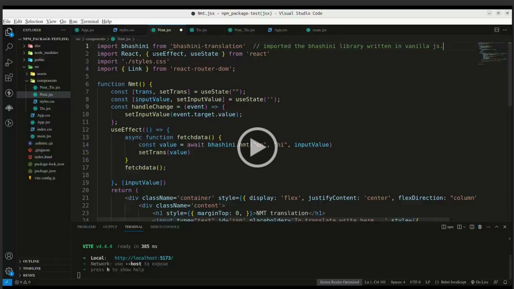

## Milestones
- [x] Test compatibility with React and Vanilla JavaScript to ensure smooth functioning in both environments.
- [x] Enhance code quality and functionality to optimize performance and user experience.
- [x] Submit the code for review to gather feedback and ensure its quality.
- [x] Demonstrate complete library functionality in React.js and Vanilla.js during mid-point showcase and PPT presentation.

## Screenshots / Videos 
<!-- 
<video controls>
  <source src="../images/jsx-rec.mp4" type="video/mp4" />   
  Your browser does not support the video tag.
</video>   -->

Video Demonstrating NMT and TTS Functionality of this Library in React.js

## Contributions
https://github.com/ULCA-IN/anuvaad-client-sdk/pull/1 

## Learnings 
-  Enable global verification with an API key, added by the user, in a library by creating a secure authentication mechanism for consistent API request authentication.
- To write reusable, and maintainable code in better way.

## Midpoint showcase review
[midpoint showcase ppt](https://docs.google.com/presentation/d/1GA03DC1m-Vr9cjHYcjv6r7ssGlwi-K7-d7bnLjYJswM/edit?usp=sharing)

My reviewer, [Suresh Unnikrishnan](https://www.linkedin.com/in/sureshunnikrishnan), praised my effort and work, stating that overall, it shows good progress. He also suggested that adding enumeration in function arguments would enhance the user experience.