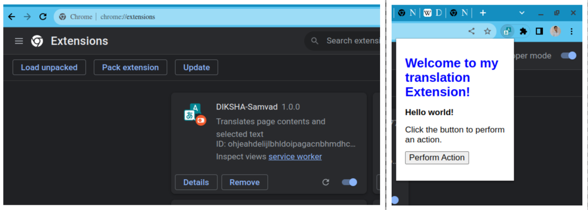

## Milestones
- [x]  Started Chrome plugin development by setting up the project and creating a `manifest.json` file.

## Screenshots / Videos 

<!-- ## Contributions -->

## Learnings
- Acquired knowledge about the structure and purpose of the manifest.json file in Chrome extension development.