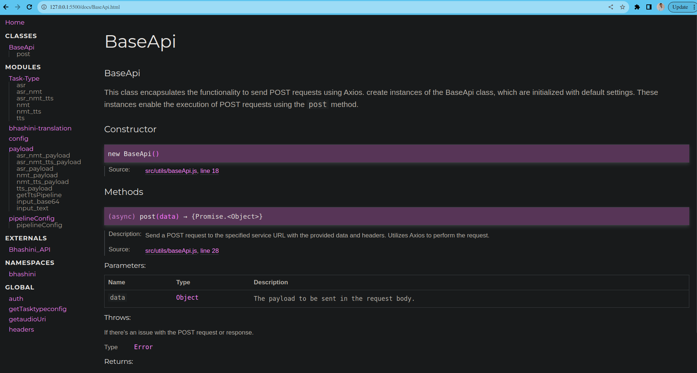
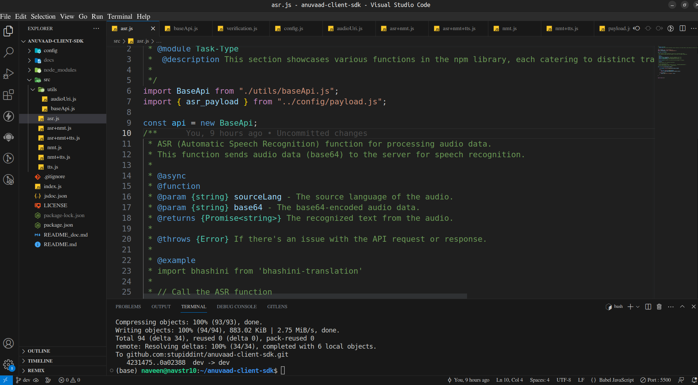

## Milestones
[x] Added JSDoc comments for documentation generation.  
    [x] Described all code and their usages in the docs.  
[x] Fixed bugs and updated code.  
[x] Added examples of all task functionalities in the documentation.  

## Screenshots / Videos 

## Contributions
https://github.com/ULCA-IN/anuvaad-client-sdk/pull/1 
## Learnings
 
Acquired knowledge of creating [JSDoc](https://jsdoc.app/) comments and utilizing the [docdash](https://www.npmjs.com/package/docdash) template, while exploring its features and applications. The user-friendly and straightforward approach of this tool enhances code comprehension, resulting in an impressive self-generated documentation website.