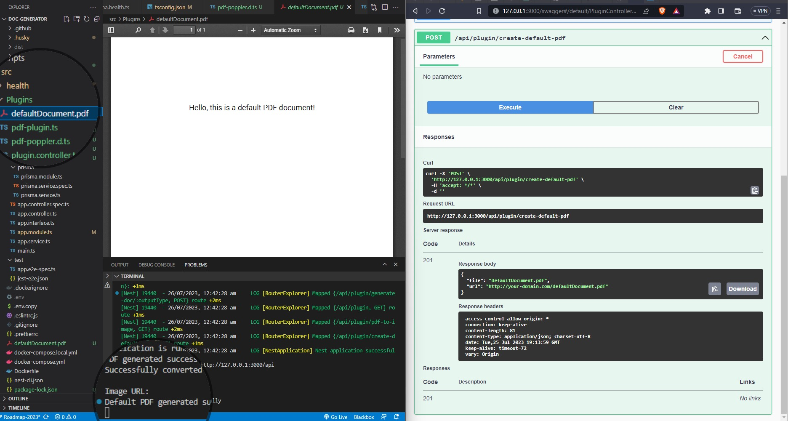

## Milestones

- [x] Developed the PdfOutputPlugin class to handle PDF-related operations, including generating PDF documents and creating default PDFs.
- [x] Added support for PDF to image conversion using the pdf-poppler library in the PdfInputPlugin class.
- [x] Implemented the transformPdfToImage method in the PdfInputPlugin to convert PDFs to images.

## Screenshots / Videos

## Contributions

## Learnings

- Focused on implementing the PDF plugin functionalities.
- Gained experience in using third-party libraries like pdf-poppler for PDF to image conversion.
- Learned about interface implementation and defining supported conversion types.
