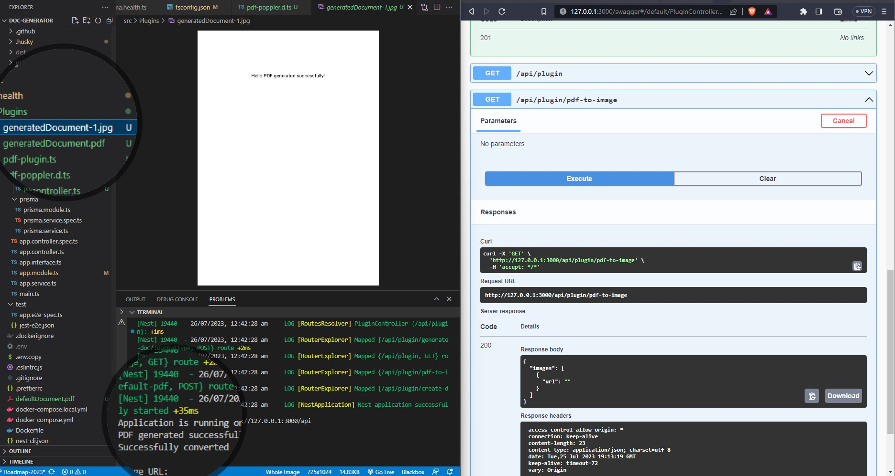

## Milestones
- Finalized and thoroughly tested API endpoints in the PluginController to allow users to generate documents, convert PDFs to images, and create default PDFs.
-  Updated the PluginModule to include the PdfOutputPlugin as a provider for seamless injection of dependencies
- Conducted code refactoring for better readability and maintainability.

## Screenshots / Videos 

## Contributions
    
    https://github.com/Samagra-Development/Doc-Generator/pull/161

## Learnings
- Focused on finalizing API endpoints for different PDF-related tasks.
- Learned about using providers in NestJS modules to maintain consistent behavior across components.
- Gained experience in refactoring code to improve readability and maintainability.