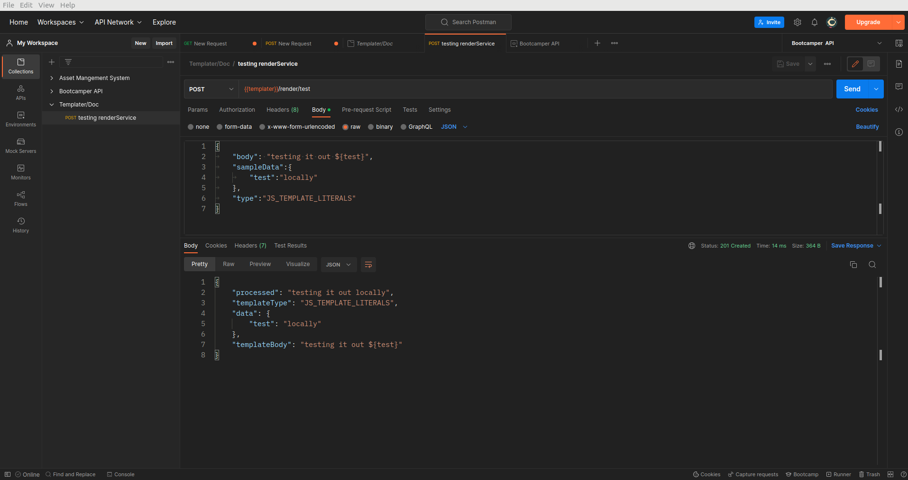

## Milestones

- [x] Test out the RenderService
- [x] Declare Types for the RenderService to ensure typesafety in the codebase when using the RenderService in Doc-Gen

## Approach

Successfully tested out the RenderService to see if its able to render the templates and it works as expected. Also declared the types for the RenderService to ensure that the codebase is typesafe when using the RenderService in Doc-Gen.
And Since it works perfectly we can move to packaging it as a npm module to use as standalone code in Doc-Gen.

We need to make sure that the RenderService is able to render the templates without the need of calling them as API's so that it can be used as a library by Doc-Gen.

Thus we create the `RenderModule` which will be responsible for rendering the templates and will be used by Doc-Gen by importing it as a npm module. It has no dependencies on the `PrismaService` and can be used as a standalone module.

Here is the link to the Midterm : [Midterm](https://docs.google.com/presentation/d/1r3OzL3aY0cobO95jRcIt4dP2zwHBR8gd/edit#slide=id.g237dcae9f68_0_19)

## Screenshots / Videos

## Contributions

Here is the link to the PR: [PR](https://github.com/Samagra-Development/templater/pull/25)

## Learnings

- How to test out the Service using Postman for api testing
- Creating a seperate Nest Module with required dependencies which can easily be injected and used.

## Next Steps

- [ ] Start creating a npm package.
- [ ] Import in Doc-Gen and test it out locally before publishing to npm registry.
