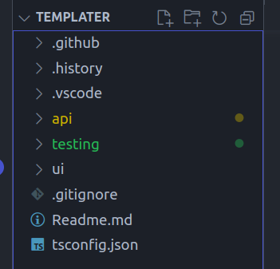
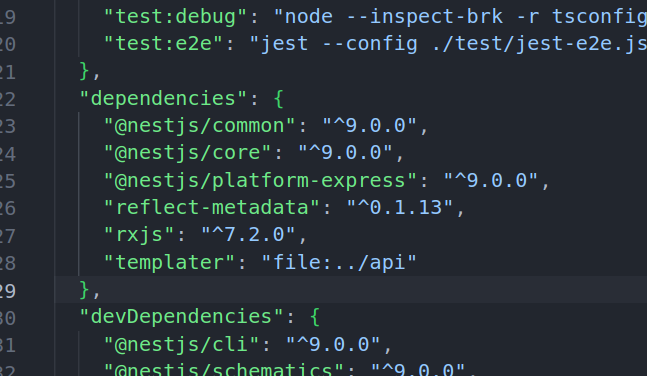
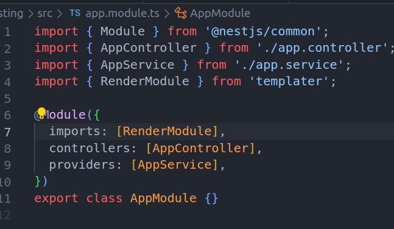
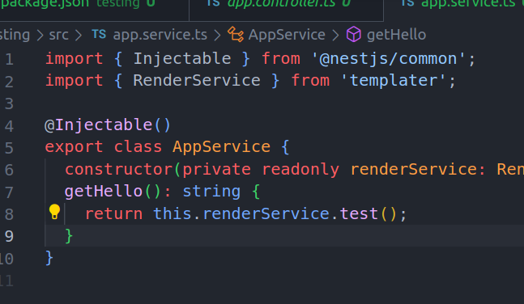
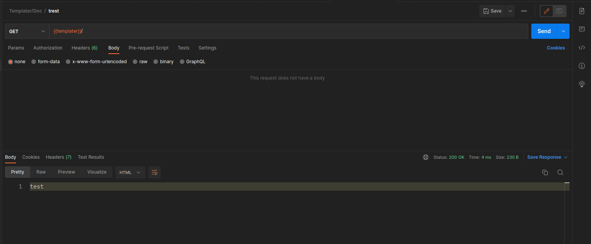

## Milestones

- [ ] Start creating a npm package.
- [ ] Import in Doc-Gen and test it out locally before publishing to npm registry.

## Approach

Now that we were able to test out our new service we can now start packaging it and export it as a npm package so that we can publish it to npm registry and use it in Doc-Gen.

Great So lets begin

### RenderModule

Render Module is a Nest Module which is responsible for rendering the templates and will be used by Doc-Gen by importing it as a npm module. It has no dependencies on the `PrismaService` and can be used as a standalone module.
So after we install the npm module we can inject this module in our `app.module.ts` and use it in our codebase.

### RenderService

Let's make up a test function which just returns a string to test out our service.

```typescript
    test(): string {
        return "Hello World";
    }
```

### Npm Package

We have two options to create a npm package here either we pack it up and use as a tarball file using `npm pack` or we can locally install it.

This is our environment here



We have two nest apps `api` and `testing` api is the main app of templater and testing is a test app which we use to test out our npm package.

Let's install our npm package

```bash
    cd testing
    npm install ../api/
```



There we go we have successfully installed our npm package and now we can use it in our codebase.

### Using the RenderService and RenderModule

Since i had created a barrel file for the RenderService and RenderModule we can easily import them in our codebase.

```typescript
import { RenderModule, RenderService } from "templater";
```



Injecting the RenderModule in our app.module.ts



Injecting the RenderService in our app.service.ts

Now that we have it up and running let's test it out.



And there we go we have successfully tested out our RenderService and RenderModule.

## Contributions

Here is the link to the PR: [PR](https://github.com/Samagra-Development/templater/pull/25)

## Learnings

- How to create a npm package.
- How to use a npm package locally.
- How to use a npm package in our codebase.
- Barrel files in typescript.

## Next Steps

- [ ] Start writing code in Doc-Gen using this npm package and providing functionalities.
