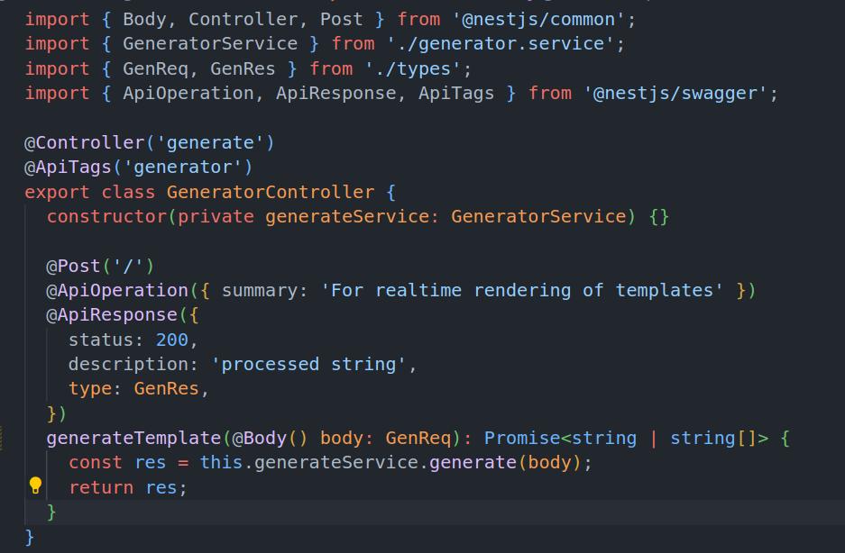
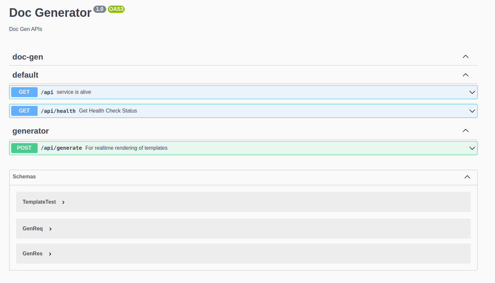

## Milestones

- [x] Plan out the structure of the codebase for Doc-Gen with respect to the OpenAPI Specification.
- [x] Start writing functionality in Doc-Gen using this npm package.

## Approach

Now that we have successfully installed our npm package in Doc-Gen we can start writing the functionality in Doc-Gen using this npm package.

Here are the API specs: [specs](https://rest.wiki/?https://gist.githubusercontent.com/AnshulMalik/513723d253ea5ef4ff37795da1dde4f1/raw/e6a71015e7b92feab633594a43dde5f12ec0efac/spec.yaml#)

Now we can start writing the functionality in Doc-Gen using the RenderService.

### Generator API

We can split it into two parts here `Realtime Render` & `Batch Processing`
For this week i've implemented the `Realtime Render` endpoint using the new RenderService, along with proper **Swagger Documentation** i've added screenshots of the Documentation below.

### User API

We need to implement an OAuth Flow using a Auth provider for now i'll be using Google Cloud as the Provider.
Here is a discussion on the topic i'll be referring to and working on: [Github](https://github.com/Samagra-Development/Doc-Generator/issues/67) 

## Screenshots / Videos

Here is the endpoint

Below is the proper **Swagger Documentation**

## Contributions

Here is the link to the PR: [PR](https://github.com/Samagra-Development/Doc-Generator/pull/164)

## Learnings

- How to install a seperate npm package in Doc-Gen as a tarball file.
- Creating a separate Nest Module with required dependencies which can easily be injected and used.

## Next Steps

- [ ] Plan out and implement the structure of the Batch Processing using RabbitMQ.
- [ ] Plan out and implement User Flow.