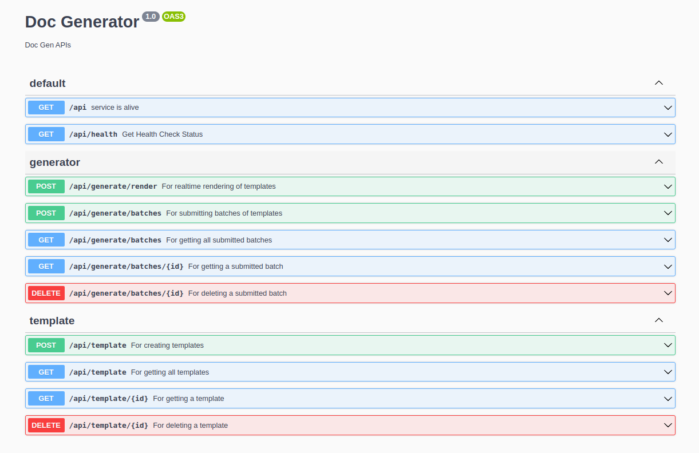

## Milestones

- [ ] Implemented Batch API
- [ ] Implemented Template API

## Approach

Alright now to complete up the Generator API we can start working on the Batch API and Template API.
The Batch API will be responsible for handling the batch processing of the templates and the Template API will be responsible for handling the templates.

This is the Batch API Spec: [specs](https://rest.wiki/?https://gist.githubusercontent.com/AnshulMalik/513723d253ea5ef4ff37795da1dde4f1/raw/e6a71015e7b92feab633594a43dde5f12ec0efac/spec.yaml#)

### Batch API

Here is the Batch schema

```typescript
export class BatchResponse {
  id: string;
  createdAt: Date;
  templateType: TemplateType;
  templateID: number;
  payload: any[];
  status: string;
  output: string[];
  outputType: string;
}
```

So this is how the flow is we will be using `RabbitMQ` for async processing using the `Producer` to send the payload to the `Worker` which will be responsible for processing the payload using `Plugins` and then updating the status of the batch with the output in the database which the user can track.

### Template API

Here is the Template schema

```typescript
export class Template {
  id: number;
  content: string;
  templateType: TemplateType;
}
```

Here is the TemplateType enum

```typescript
export enum TemplateType {
  JINJA = "JINJA",
  EJS = "EJS",
  JSTL = "JSTL",
}
```
Using the Template API the user can create, update, delete and get the templates.
All the endpoints are properly documented using **Swagger Documentation**.

## Screenshots / Videos

_Swagger Docs_




## Contributions

Here is the link to the PR: [PR](https://github.com/Samagra-Development/Doc-Generator/pull/168)

## Next Steps

- [ ] Implement the Batch API using RabbitMQ.
- [ ] Implement the OAuth Flow using Google Cloud as the provider.
