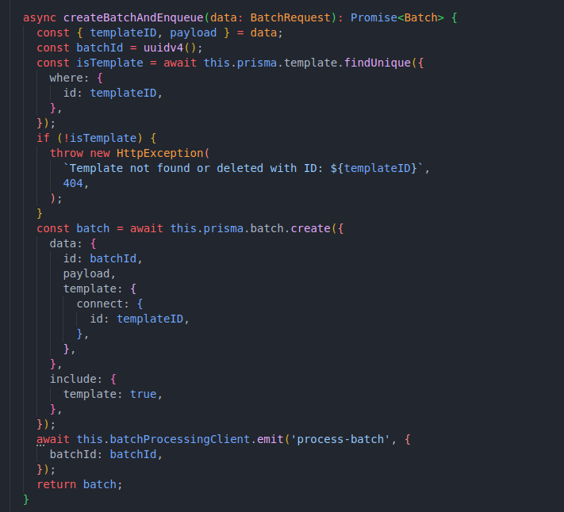
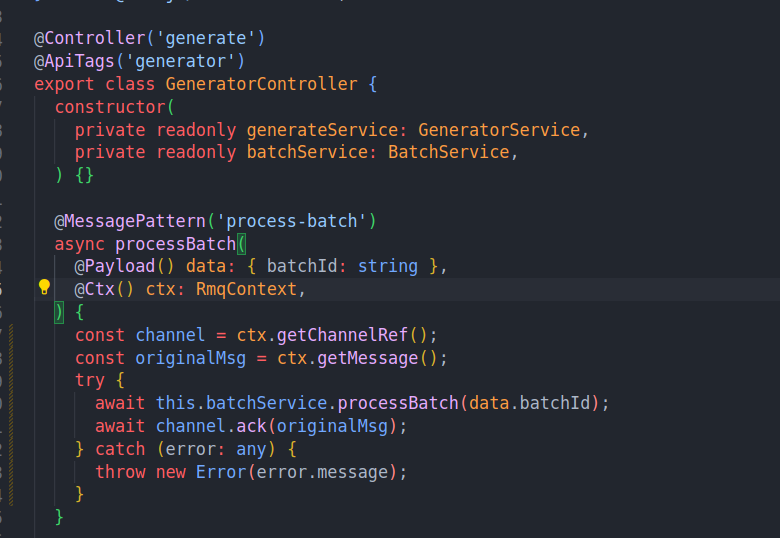
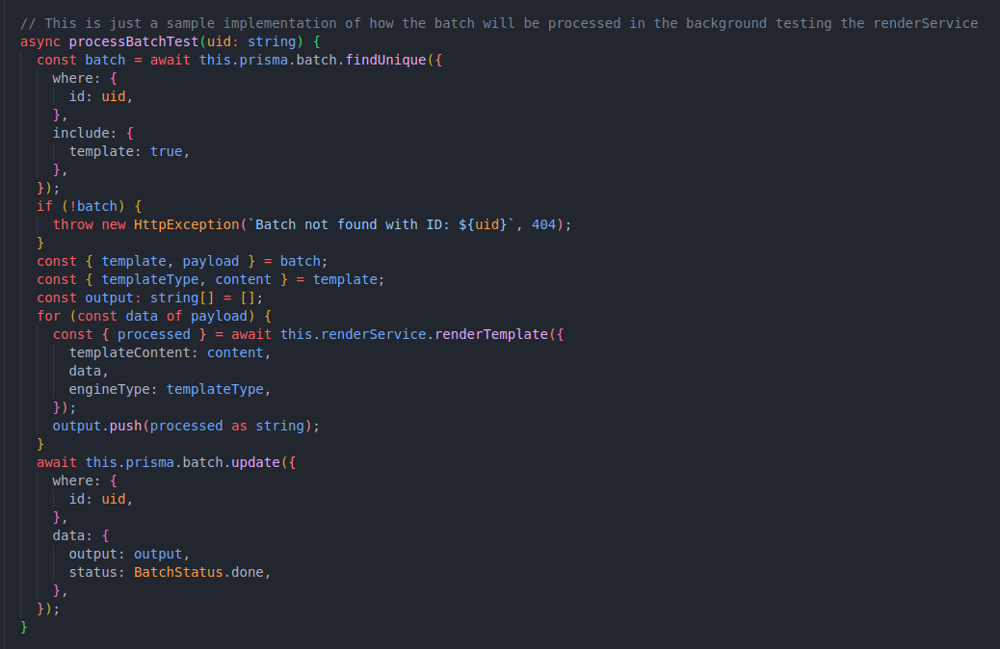
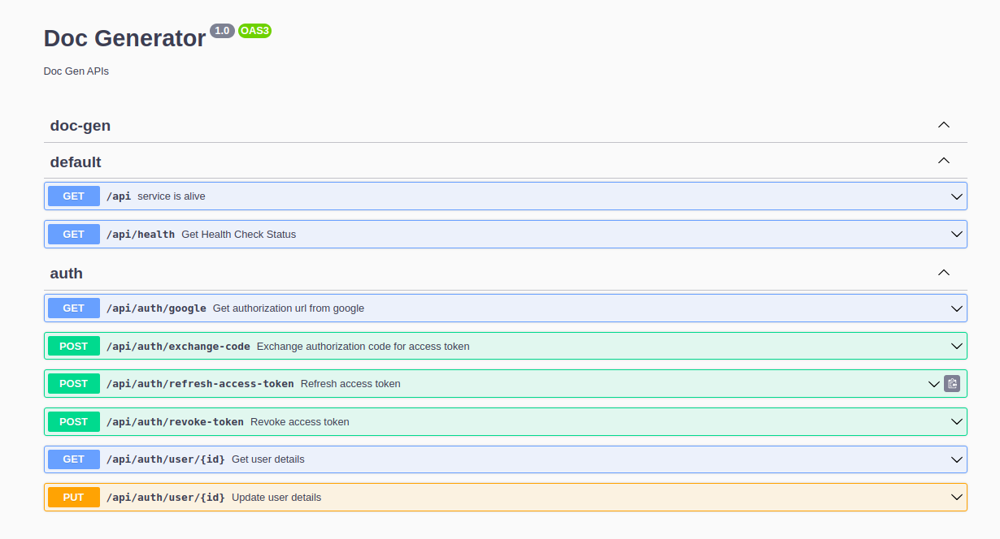

## Milestones

- [x] Implement the Batch API using RabbitMQ.
- [x] Implement the OAuth Flow using Google Cloud as the provider.
- [x] Use Jest to write tests for the APIs.

## Approach

### Batch API

We implemented the Batch API endpoints but we had not yet added async processing using RabbitMQ. So we added the async processing using RabbitMQ. We used the `Producer` to send the payload to the `Worker` which will be responsible for processing the payload using `Plugins` and then updating the status of the batch with the output in the database which the user can track.

For this task the following [Docs](https://docs.nestjs.com/microservices/rabbitmq) were really helpful as NestJS has a really good documentation along with some great support for RabbitMQ.

The message that we send to the `Worker` is of the following type:

```typescript
export class BatchMessage {
  batchId: string;
}
```

When a user creates a batch the `Producer` sends the `batchId` to the `Worker` which then processes the batch and updates the status of the batch in the database.

And for consuming the message we used the `@MessagePattern` decorator which is provided by NestJS.
The great thing about this decorator is that it automatically parses the message and we can directly use the message in the function along with the `@Payload()` decorator.
Another great thing is `Requeueing` the message if the processing fails. We can do this by throwing an exception in the function and the message will be requeued.

So i created a `processBatch` method in BatchService which is responsible for processing the batch and updating the status of the batch in the database in the MessagePattern handler after we receive the message from the `Producer` we process the batch and if no exception is thrown we update the status of the batch to `done` and acknowledge the message so that it is removed from the queue.

### Auth API

We implemented the OAuth Flow using Google Cloud
Pretty straightforward implementation using the following [Ticket](https://github.com/Samagra-Development/Doc-Generator/issues/67)
Below is the OAuthService interface which is responsible for handling the OAuth Flow.

```typescript
export interface OAuthService {
  getAuthorizationUrl(options: AuthorizationOptions): string;
  exchangeAuthorizationCode(authorizationCode: string): Promise<AccessToken>;
  refreshAccessToken(refreshToken: string): Promise<AccessToken>;
  revokeToken(token: string): Promise<void>;
}
```
Along with proper **Swagger Documentation**.

### Testing

We used Jest to write multiple tests for the APIs.
We wrote tests for the Batch API and the Auth API, Template APIs.

## Screenshots / Videos

**Batch**







**Auth**



## Contributions

**Batch** PR: [PR](https://github.com/Samagra-Development/Doc-Generator/pull/168)
**Auth** PR: [PR](https://github.com/Samagra-Development/Doc-Generator/pull/171)

## Note

Well, this is my last week of C4GT, and I would like to express my heartfelt gratitude to my mentors for their support throughout the program. They have been instrumental in guiding me whenever I faced challenges. I also extend my sincere thanks to the entire Samagra team for affording me the opportunity to work on such a captivating project, along with always being available to answer my questions.

I commend the Samagra team for maintaining discipline and consistently achieving remarkable outcomes, a task that is both substantial and demanding, especially with such a large group of people. This experience has been invaluable, providing me with numerous insights. From time management to implementing sophisticated systems like a Batch Processing setup using RabbitMQ, I have gained a wealth of knowledge.

I am genuinely appreciative of how this experience has offered me a glimpse into the world of professional coding. Overall, it has been an exhilarating journey. I hope that everyone gets a chance to participate in such a program at least once in their life. The lessons learned, the sense of community, and the experiences gained are truly invaluable.
