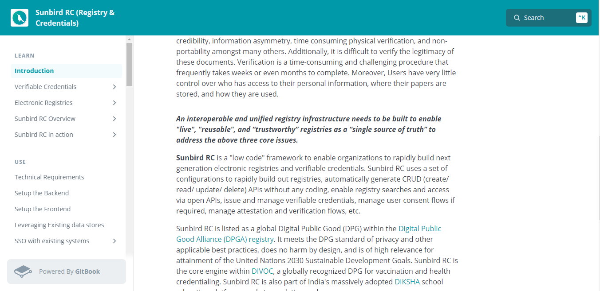

## Milestones
- [x] Conduct meetings and discussions with mentor to gather detailed requirements for the Competency Passbook application.
- [x] Familiarize with the iGOT Karmayogi platform and its existing infrastructure.
- [x] Familiarize with the development tools, frameworks, and technologies utilized in Sunbird RC.

## Screenshots / Videos 

## Learnings
- [x] Familiarize with the Karmayogi platform, which is built on top of Sunbird RC.
- [x] Study and understand the documentation of Sunbird RC, the underlying platform for Karmayogi.