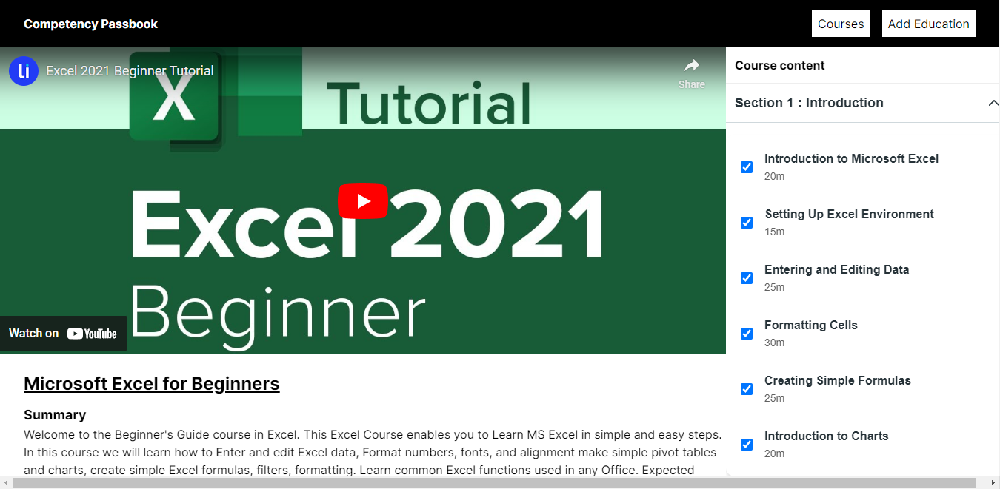
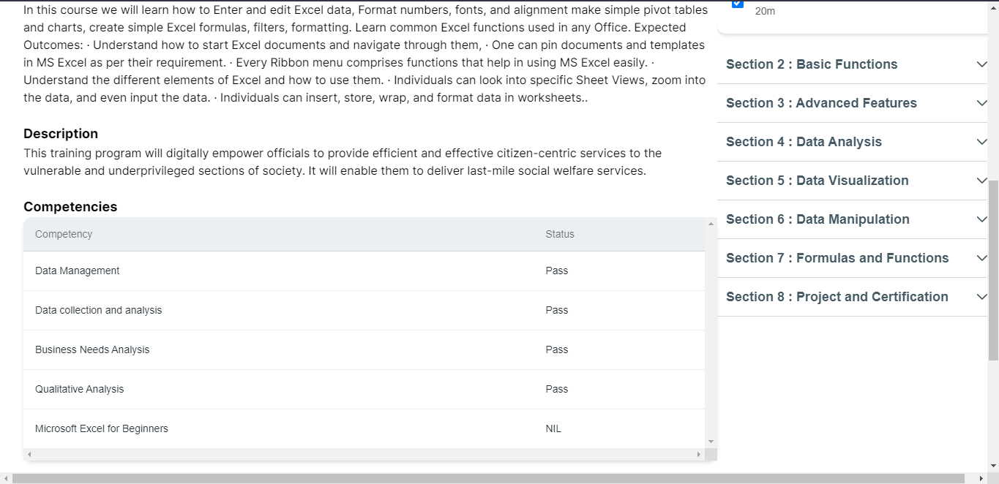
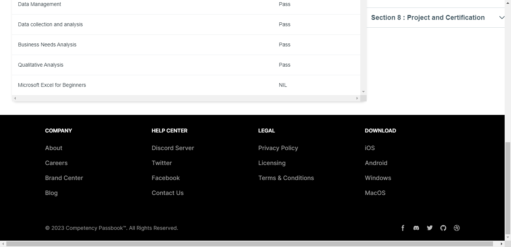

## Milestones

- [x] Created new API endpoints for courses.
- [x] Implemented competency creation functionality for courses.
- [x] Conducted analysis of the Competency Passbook (CP) feature.
- [x] Successfully deployed all changes to the platform.

## Screenshots / Videos

## Contributions

- https://github.com/Sumitmaithani/competency-passbook/pull/7
- visit website : https://competency-passbook.vercel.app

## Learnings

- [x] Gained a deeper understanding of API development and integration for courses.
- [x] Enhanced my skills in implementing new features and functionalities, such as competency creation.
- [x] Developed proficiency in analyzing and improving the Competency Passbook (CP) feature.
- [x] Strengthened my knowledge of deployment processes and strategies for web applications.
