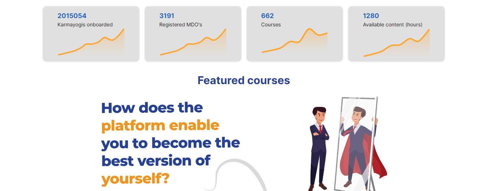
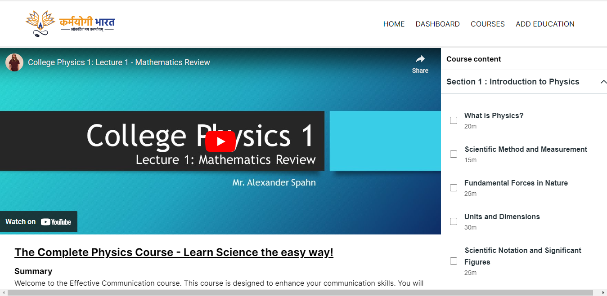

## Milestones
- [x] Successfully revamped the website design, enhancing its visual appeal and user experience.
- [x] Identified and addressed several bugs and issues, ensuring a smoother and error-free browsing experience.

## Screenshots / Videos 

## Contributions
- https://github.com/Sumitmaithani/competency-passbook/pull/8

## Learnings
- [x] Gained a deeper understanding of web design principles and user experience optimization through website revamp.
- [x] Enhanced my problem-solving skills by identifying and resolving various bugs and issues in the website.