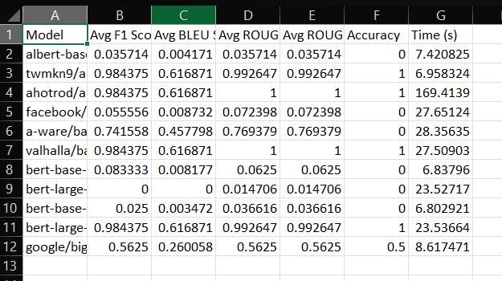

## Milestones
- [x] Started working on Evaluation Script for LLM Models. 
- [x] Tested 60 LLM models using Transformers and Hugging face.
- [x] Finalized hard-coded context and ground truth answers for testing LLM models. 
- [x] Successfully generated the first evaluation table summarizing the results of LLM model assessments.

## Screenshots / Videos
-  

## Contributions
- [Evaluation Script and Evaluation Results](https://github.com/sunbird-cb/llm-question-answering/blob/main/LLM_Testing/Evaluation_Script.ipynb)

## Learnings
- Learnt in depth about tokenizer variations.
- Learnt about Question-Answering Pipeline using transformers. 
- Gained proficiency in working with Huggingface and Transformers. 
- How to write modular code and its importance  facilitating code maintainability, scalability, and collaboration among team members.
- Continuously engaged with the mentor for guidance and feedback to ensure project success. 