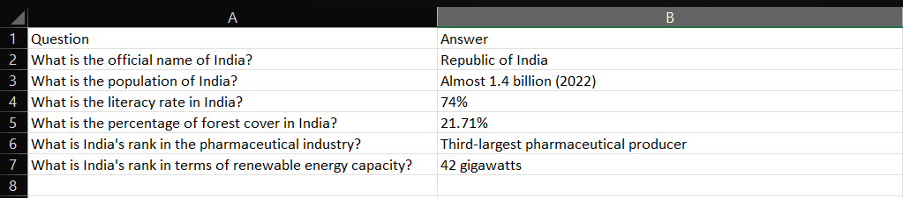

## Milestones
- [x] Worked on langchain pipeline creation for demo.
- [x] Created function to extract top-n coreferenced paragraphs from vector database.
- [x] Formulated Ground Truth vs LLM Answer Table from langchain LLM results.
- [x] Wrote function to persist data in vector database. 
- [x] Collaborated with team members to ensure seamless integration of the Langchain pipeline with other project components

## Screenshots / Videos 
- 

## Contributions
- [LLM Pipeline Results on Sample Document](https://github.com/vanshika230/C4GT/blob/main/Data/India_rcvdans.xlsx)

## Learnings
- [MidPoint Demo Slide link](https://docs.google.com/presentation/d/1aLUuRKplgQJTyL35WFFRFSEPJCBg9SFr/edit?usp=sharing&ouid=107590927429505521510&rtpof=true&sd=true)
- Mid-point demo Mentor feedback :- Get started with top-n paragraph retrieval function and fine-tuning of chosen LLM model. 
- Learned about Langchain using its documentation. 
- Studied about vector similarity search in vector database. 
- Gained practical experience in fine-tuning a selected LLM model.
