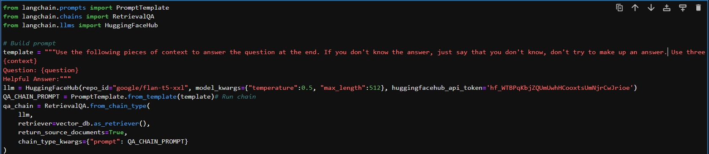

## Milestones
- [x] Explored the functionality of the Milvus database and gained a deeper understanding of its features.
- [x] Implemented the extraction of top 'n' documents from the Milvus database using Langchain.
- [x] Worked on Qsuery Embeddings with Intructor Embeddings. 
- [x] Worked on experimenting with vector-similiarity search of query with ingested coreferenced paragraphs. 

## Screenshots / Videos 
- 

## Learnings
- Learned how to integrate Milvus database functionalities into the project's workflow.
- Learned how milvus database operates.
- Explored vector similarity search methods in milvus.
- Understood the high-level architecture and overall design workflow needed for the data retrieval.
- Realized the importance of continuous experimentation and testing when working with data retrieval and search methods, ensuring optimal results and system performance.
