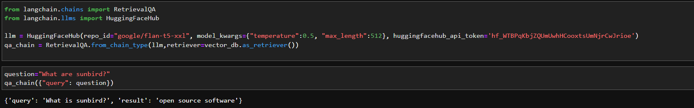

## Milestones
- [x] Worked on making query embeddings better and more powerful. 
- [x] Tested various QA chains in Langchain evaluating their effectiveness in different scenarios and use cases.
- [x] Tested various milvus retrieval methods including advanced querying techniques and indexing strategies, to optimize data retrieval efficiency and accuracy.

## Screenshots / Videos 
- 

## Contributions
- [QA Chain](https://github.com/sunbird-cb/llm-question-answering/blob/main/Question_Answering_Chain.py)

## Learnings
- Explore Retrieval QA Chain in depth in Langchain 
- Studied milvus langchain documentation in depth. 
- Conducted extensive testing and evaluation of different QA chains in Langchain, emphasizing the importance of selecting the most appropriate chain to optimize the project's question-answering capabilities.
- Gained proficiency in evaluating the trade-offs between different QA chains and Milvus retrieval methods, considering factors like response time, accuracy, and resource consumption.
