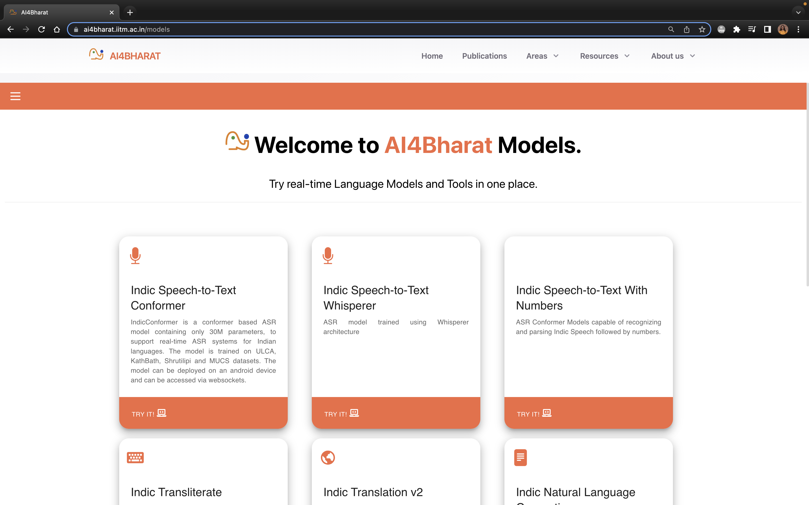
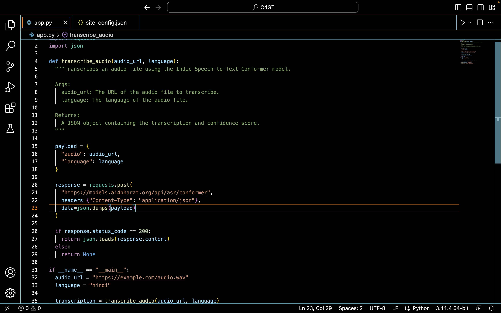
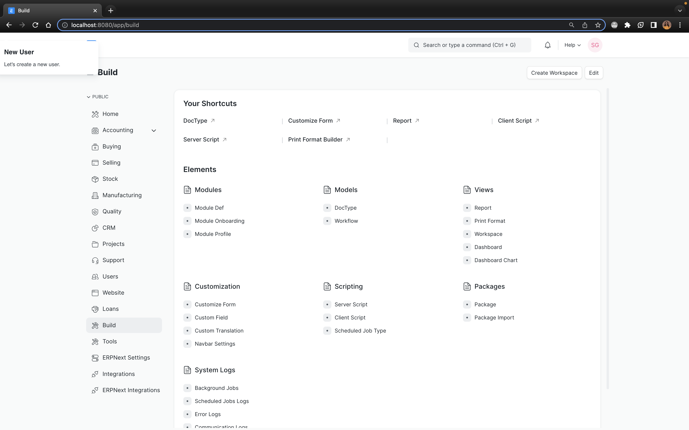

## Milestones
- [x] Learn about AI4Bharat Model.
- [x] Write Python script for API calling on the model.
- [x] Testing the model with model url.
- [x] frappe setup using docker.

## Screenshots / Videos 

- AI4Bharat
  
- Python Script
  
- Frappe
  

## Contributions

## Learnings
- AI4Bharat Voice to text transcribe models
    
    AI4Bharat is building open-source, state-of-the-art speech recognition models for Indian languages. Their models are trained on large datasets of audio and text, and they can be used to transcribe speech in a variety of Indian languages. The models are also deployable on mobile devices, making them accessible to a wide range of users.

    Some of the key features of AI4Bharat's voice to text models:

    -   They are trained on large datasets of audio and text, which allows them to transcribe   speech with high accuracy.
    -   They can be used to transcribe speech in a variety of Indian languages.
    -   They are deployable on mobile devices, making them accessible to a wide range of users.

- Frappe installation
    
    Docker is a containerization platform that allows you to package an application and its dependencies into a single image. This makes it easy to deploy and run applications on different platforms.
    Frappe is a web-based business management system that can be used to manage a variety of business processes.
    To install Frappe using Docker, you need to install Docker Community Edition and Docker Compose. Once you have installed these, you can clone the Frappe Docker repository and run the docker-compose up command.
    This will start the Frappe application in a Docker container. You can then access the application at http://localhost:8000.
    Some of the benefits of installing and setting up Frappe using Docker:

    -    It is easy to deploy and run Frappe on different platforms.
    -    It is scalable and can be easily scaled up or down to meet the needs of your business.
    -    It is secure and can be easily protected from security threats.