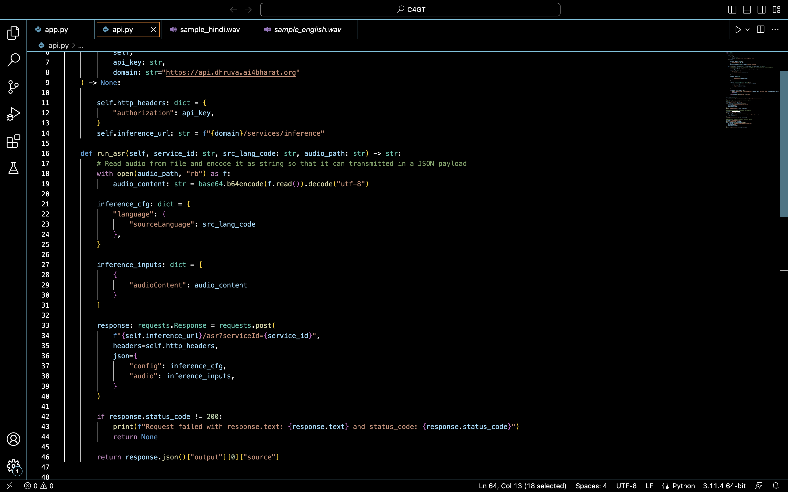
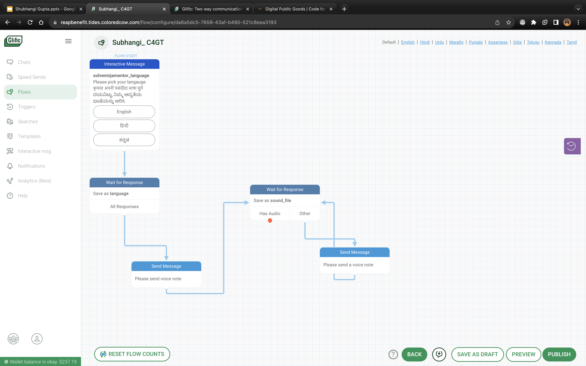
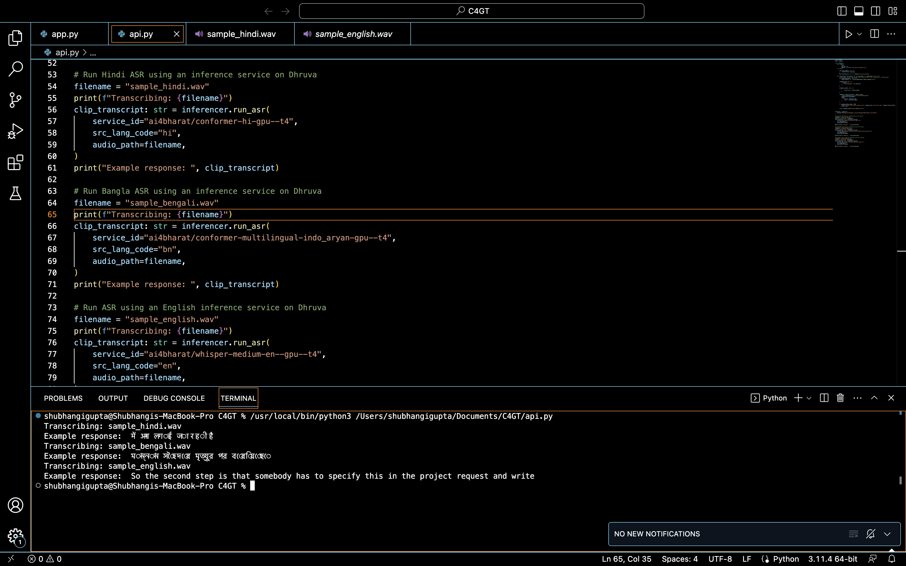

## Milestones
- [x] AI4Bharat ASR model script written API Key. 
- [x] Started working on Glific Flows.
- [x] Tested the script on local system

## Screenshots / Videos 
- API Script
  
- Glific Flow
  
- Testing 
  

## Contributions

## Midpoint Demo
- ### MidPoint Showcase Presentation
   - [Solve Ninja Chatbot Presentation](https://docs.google.com/presentation/d/15cYDo6pc31UU4fj71XHEabRgeXsefM-k/edit?usp=sharing&ouid=104605336658846330492&rtpof=true&sd=true)

- ### Feedback
    - Reviewers comments were positive and suggested to increase the pace to achieve the planned milestones.

## Learnings
Learning about Glific interface and how to create flows and webhooks.
    