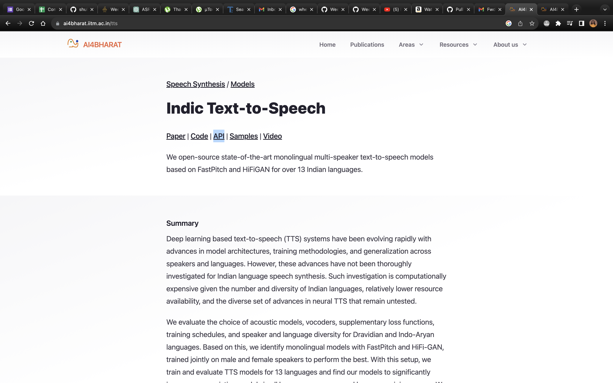
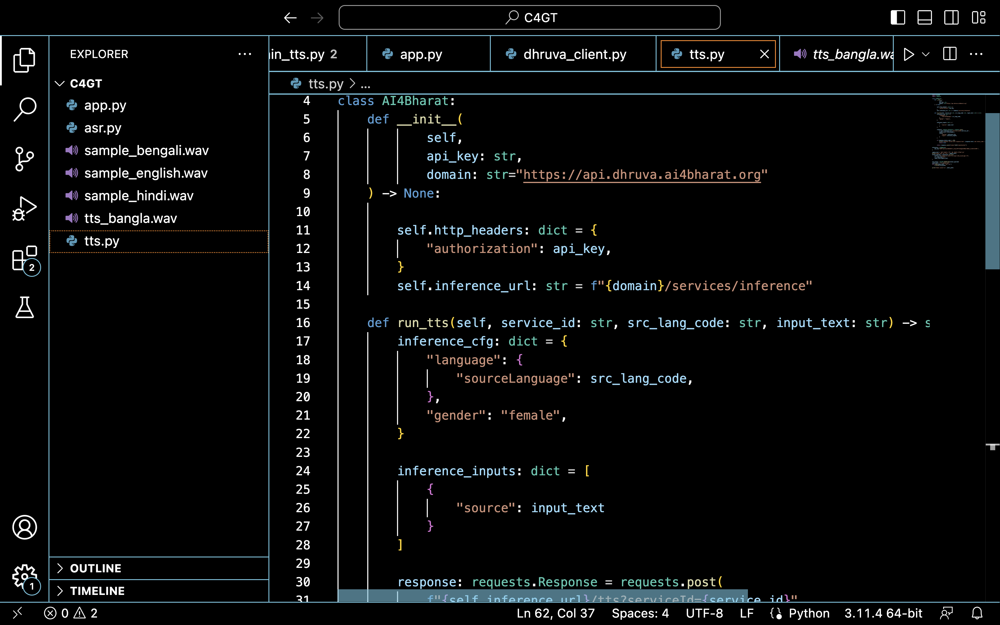

## Milestones
- [x] Feature addition
- [x] Text to voice integration model study
- [x] API script for text to voice model

## Screenshots / Videos
- Model Study
    
- API script 
    

## Contributions

## Learnings
- AI4Bharat Voice to text transcribe models
    AI4Bharat TTS is an open-source project by IIT Madras that provides state-of-the-art text-to-speech models for 13 Indian languages. The models are based on FastPitch and HiFiGAN, and they can generate high-quality speech with a variety of accents and speaking styles. The project also provides a set of tools and resources for developing and deploying TTS applications for Indian languages.

    Here are some of the key features of AI4Bharat TTS:

    State-of-the-art models for 13 Indian languages: The models are trained on large datasets of text and audio, and they can generate high-quality speech with a variety of accents and speaking styles.
    Open-source: The models and code are released under the Apache 2.0 license, so they can be freely used and modified by anyone.
    Easy to use: The project provides a set of tools and resources to make it easy to develop and deploy TTS applications for Indian languages.

