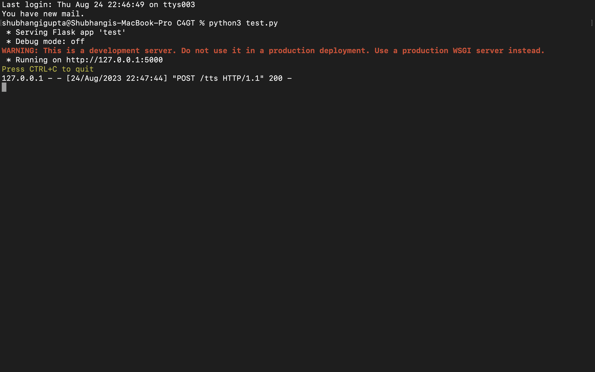
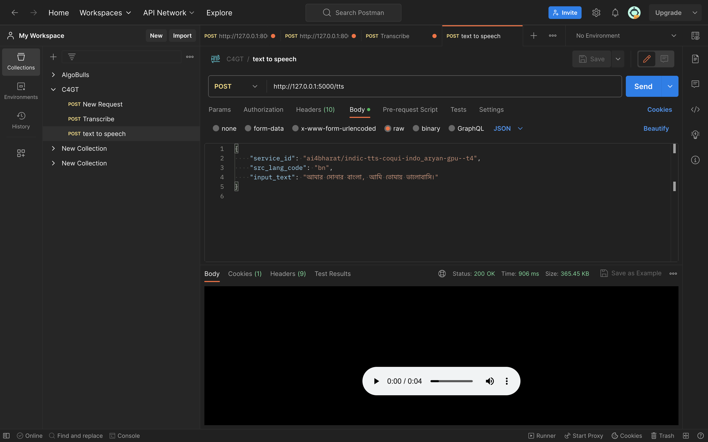

## Milestones
- [x] API script for text to voice completed
- [x] Testing of the API script on local system

## Screenshots / Videos 
- API Script
  .png)
- Script testing on terminal
  
- API working of model
  

## Learnings
- Postman
    Postman is an API development environment that allows you to send HTTP requests to APIs, view the responses, and debug your requests. It is a powerful tool that can be used to test, document, and share APIs.
    To use Postman for API calling, you first need to create a new request. In the request, you need to specify the URL of the API, the HTTP method, and the request body. You can also specify headers and other parameters.
    Once you have created your request, you can send it by clicking on the Send button. Postman will then send the request to the API and display the response.
    You can use Postman to test different types of APIs, including REST APIs, SOAP APIs, and GraphQL APIs. You can also use Postman to create and share collections of requests.

