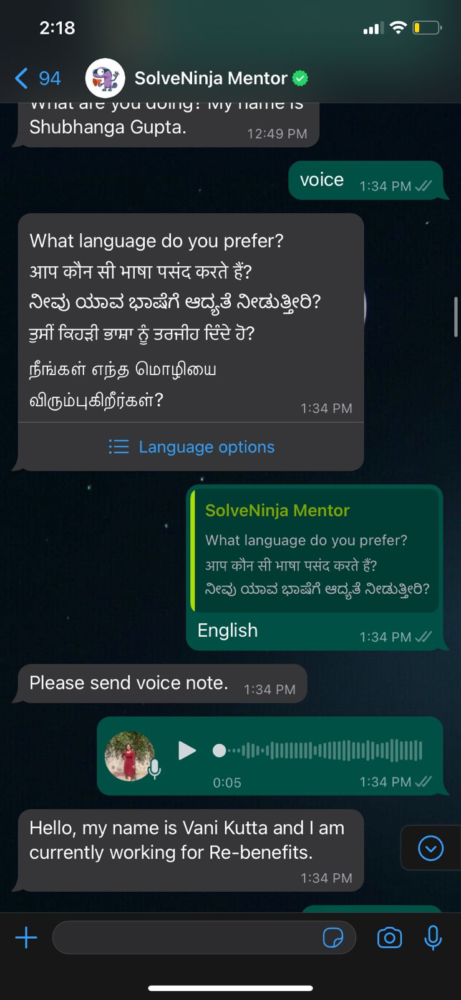
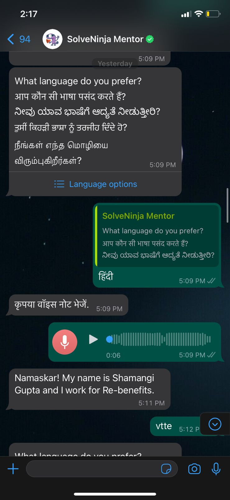
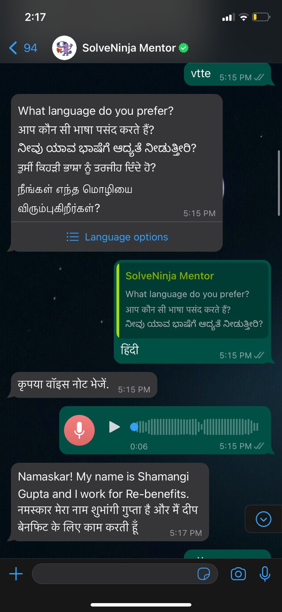
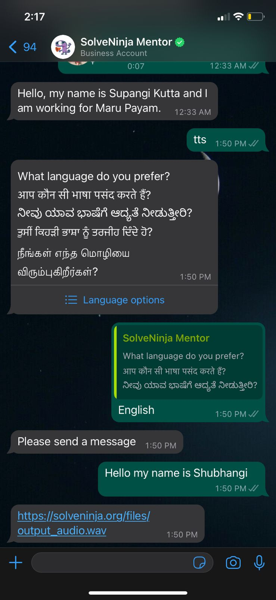

## Milestones
- [x] Feature made live on WhatsApp
- [x] Testing of the feature

## Screenshots / Videos
- Voice-to-text(Local language to local language)
  
- Voice-to-text(Local language to english)
  
- Voice-to-text(Local language to both english and local)
  

- Text-to-speech
  

## Learnings
WhatsApp chatbot
Testing 