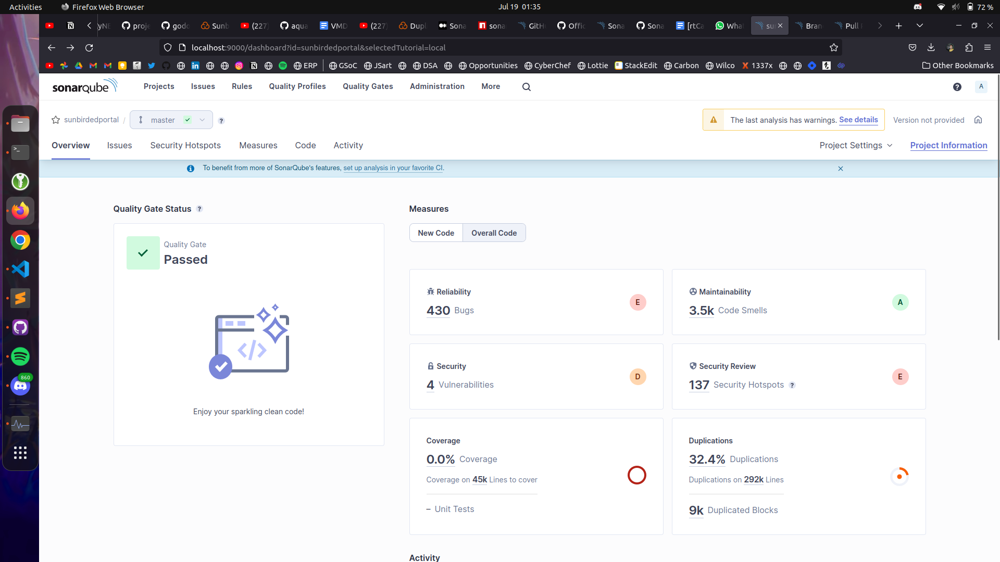
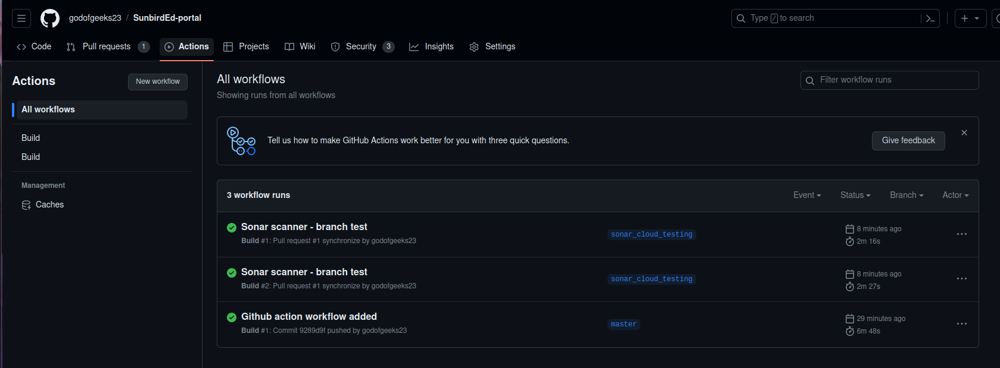
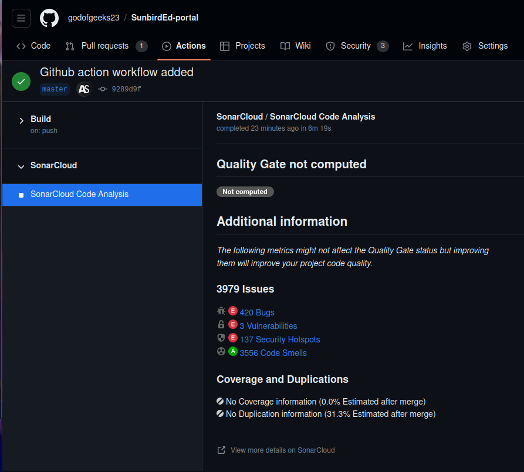

## Milestones
- [x] Setting up SonarQube locally
- [x] Setting up SonarCloud
- [x] Understanding properties of sonar-project.properties file
- [x] Setting up automated scans for code security using GitHub Actions

## Screenshots / Videos 

## Contributions

## Learnings

