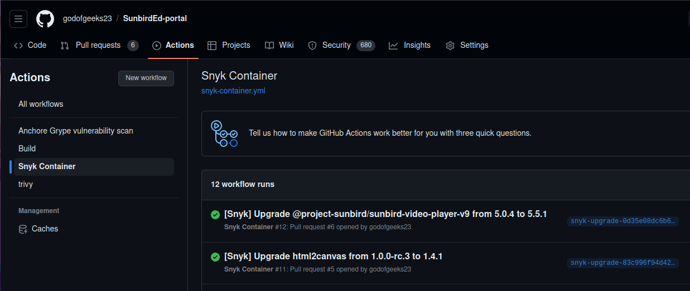
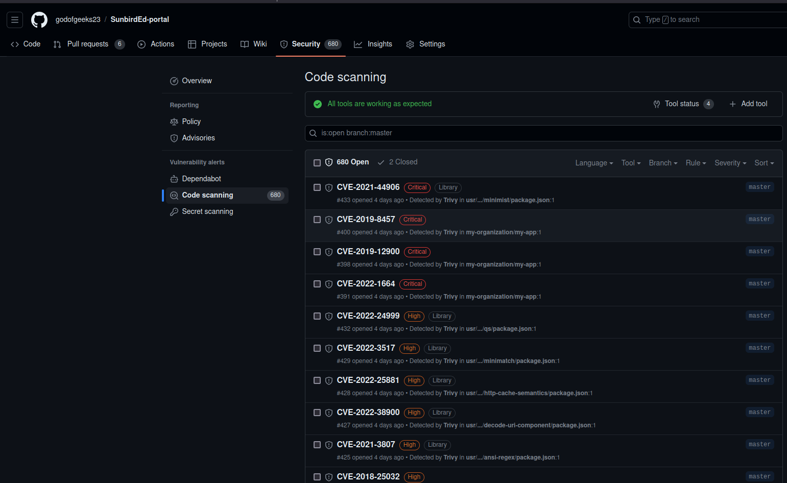
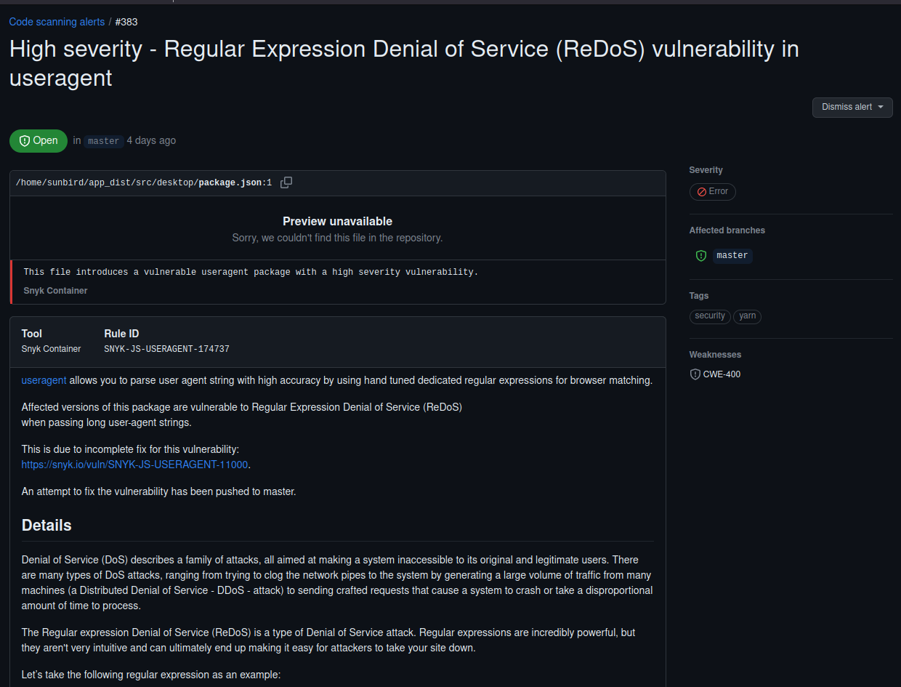

## Milestones

- [x] Exploring tools for Container Security
- [x] Testing GitHub Actions for Container Security - Snyk, Trivy, and Anchore (Grype)
- [x] Integrating Snyk and Anchore(Grype) Container scanning with SunbirdEd-portal repo

## Screenshots / Videos

## Contributions

[Pull Request 1](https://github.com/santhosh-tg/SunbirdEd-portal/pull/1)

[Pull Request 2](https://github.com/santhosh-tg/SunbirdEd-portal/pull/2)

## Learnings

[Presentation Link](https://docs.google.com/presentation/d/19b6BrzyyrspH6WHILqWP9LtB3kvQV5Mu/edit?usp=sharing&ouid=112598792481718545981&rtpof=true&sd=true)

Supermentor Feedback - 

1. Deciding the phase in the pipeline of when the scanning should be performed - pereferably during the image building in the jenkins, before it is pushed / deployed.
2. Providing more integrated and informational reports of the vulnerabilities involed, so that more context is visible regarding fixing it.
