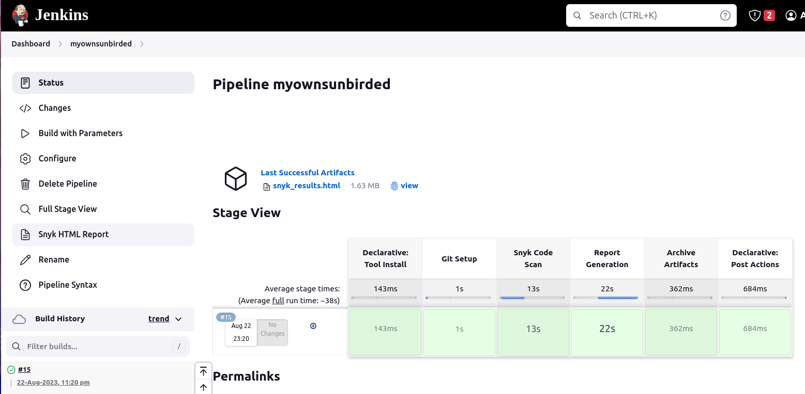
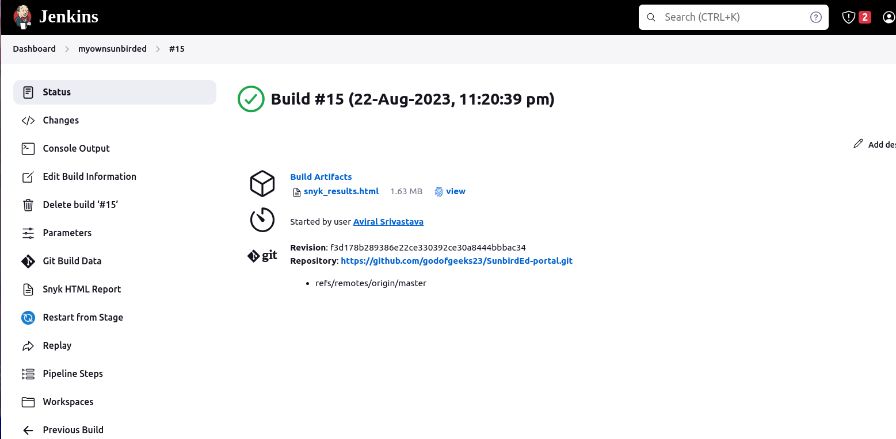
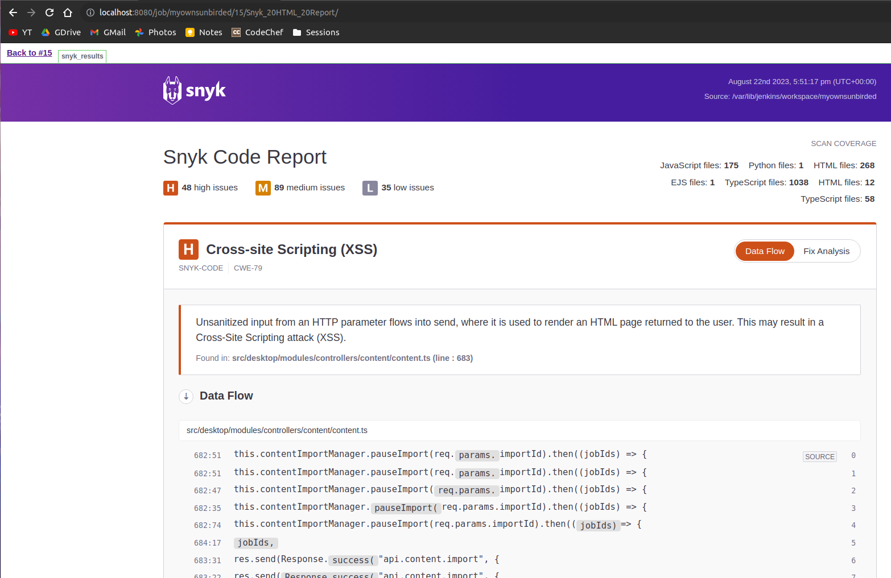

## Milestones
- [x] Setup exporting reports from Snyk scans to HTML format
- [x] Saving scan results as artifacts in Jenkins
- [x] Publish the HTML report artifacts

## Screenshots / Videos 

## Contributions

## Learnings

1. Learned to export Snyk scan reports in HTML format.
2. Learned about Artifact Management in Jenkins.
3. Explored more jenkin plugins example NodeJS and HTML Publisher.

