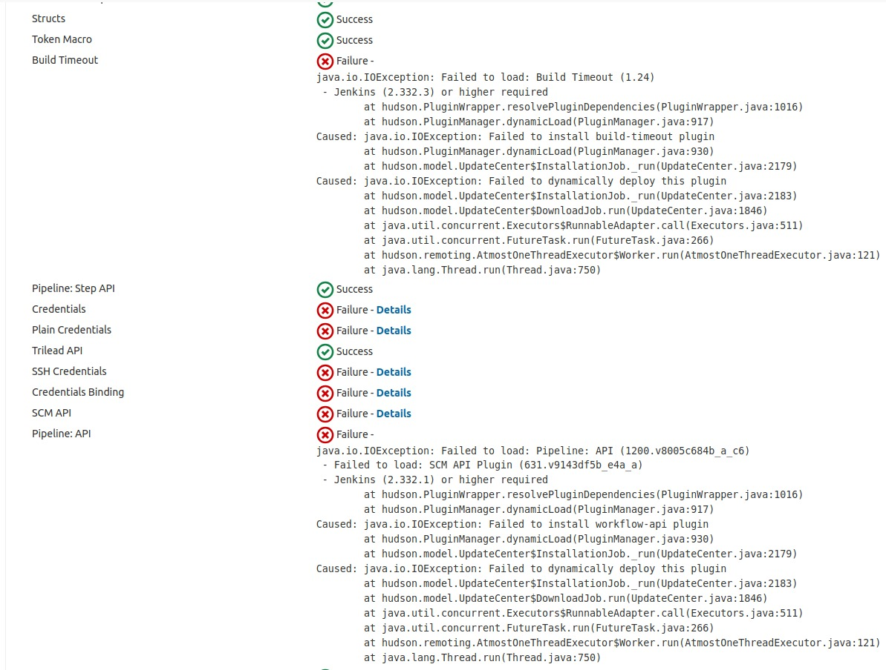
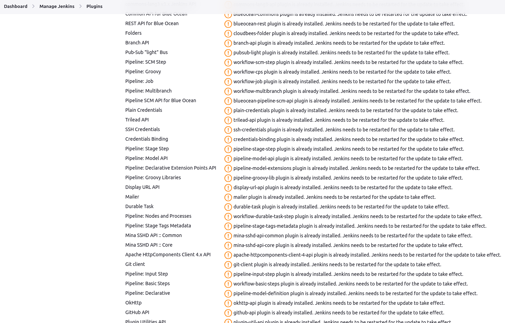

## Milestones
- [x] Fixed server-setup script to work with latest version of Jenkins, Java
- [x] Fixed jenkins version in server-setup script to install all plugins correctly

## Screenshots / Videos 

Previous server-setup script setup old version of Jenkins which did not support many plugins - 

Fixed now - 

## Contributions

[Pull Request 1](https://github.com/project-sunbird/sunbird-devops/pull/3890)

## Learnings

1. Learnt about lot of different Jenkins plugins.
2. Learnt about Shared Libraries in Jenkins.