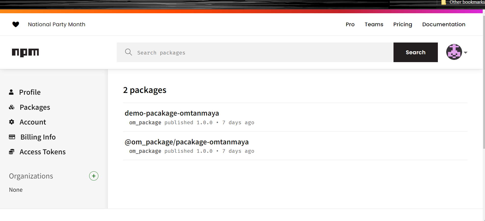

## Milestones
#### Milestone 1: 📚 Complete Understanding of OAuth 2.0
📖 Research and study OAuth 2.0 extensively.
💡 Gain a comprehensive understanding of OAuth 2.0 principles, flows, and security mechanisms.
📦 Create my own npm package to implement OAuth 2.0 in my projects.
#### Milestone 2: 🏗️ Implementing Custom Package
🛠️ Develop a custom npm package for integration.
🧪 Test and validate the package's functionality in various projects.
 #### Milestone 3: 🔑 Login Integration
🚪 I am currently in the process of implementing OAuth 2.0 login in my existing project.
 

## Screenshots / Videos 

## Contributions

## Learnings
Milestone 1: 📚 Gain a complete understanding of OAuth 2.0 and create my own npm package for future implementation in projects.

Learned the fundamental concepts and workings of OAuth 2.0.
Acquired skills to create an npm package for OAuth 2.0 integration.
Milestone 2: 🏗️ Build a custom npm package   integration, ensuring it works smoothly in different projects and environments.

Gained hands-on experience in developing a custom npm package.