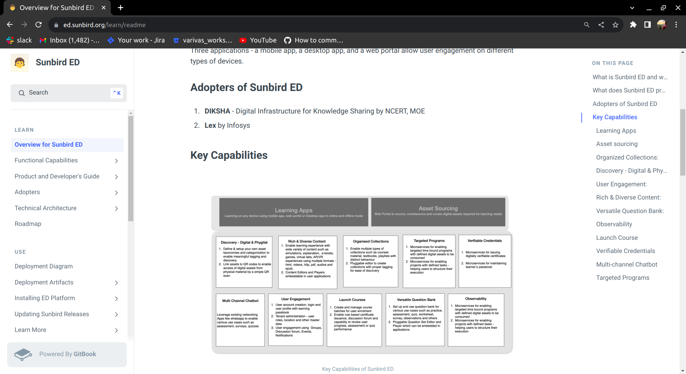

## Milestones
- [x] I have actively engaged in learning and familiarizing myself with the Technical Specifications.
- [x] Acquired in-depth knowledge of Sunbird-Ed architecture and its components.

## Screenshots / Videos 

## Contributions

## Learnings
- [x] Study and understand the documentation of Sunbird Ed
