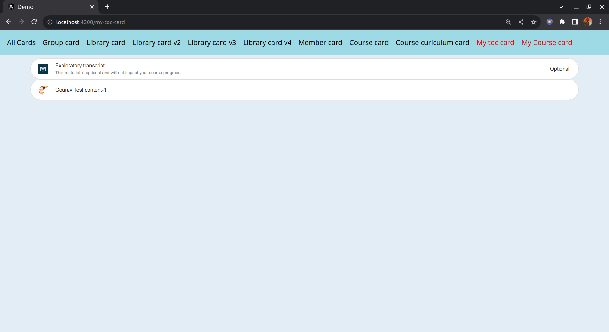

## Milestones
#### Milestone 1 - UI Part 🚀:
In this milestone, my current task involves developing UI changes and implementing a clear distinction between optional materials and regular content within the common consumption package.

## Screenshots / Videos 

## Contributions

## Learnings
- [x] I have acquired the knowledge of linking local packages in a separate project and have explored multiple methods to accomplish this.