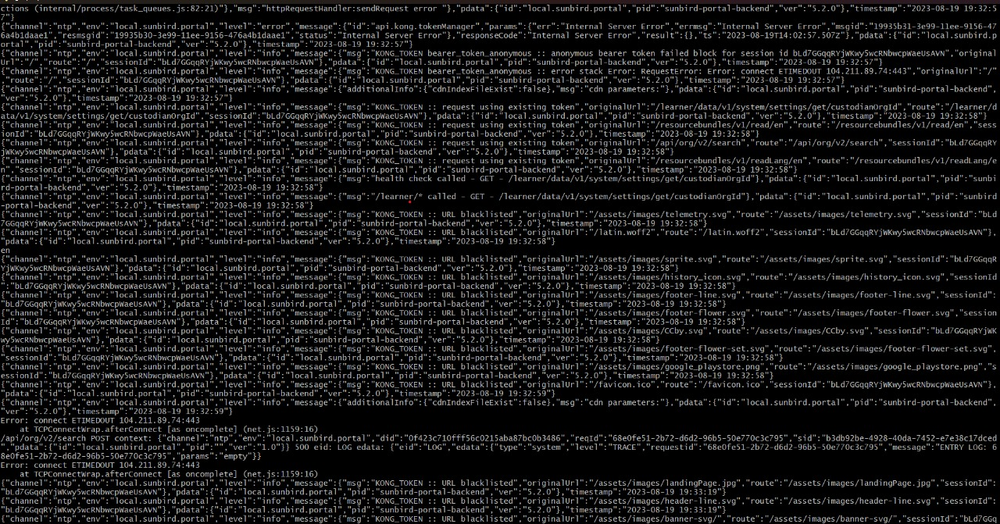
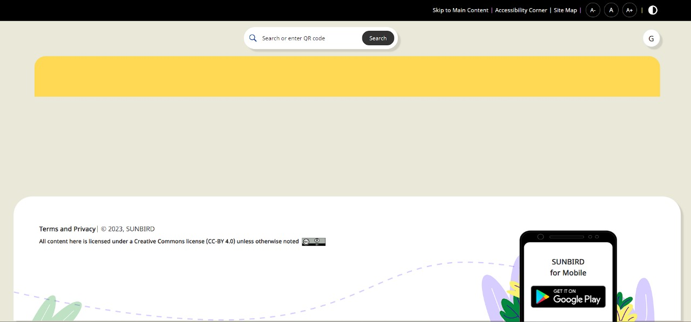

## Milestones

- [x] Got database errors for almost whole week and was not able to work on the project
- [x] Had whereas exams so focused only on learning angular
- [x] Made a plan for isolating the content detail page components from the rest of the code base

## Screenshots / Videos 
Database errors

## Contributions

## Learnings
🎯 Milestone 1: Got database errors for almost whole week and was not able to work on the project

I learned that sometimes you cannot do anything about the errors and you just have to wait for them to be resolved. I learned how to deal with such situations and how to manage time when you are not able to work on the project.

🎯 Milestone 3: Made a plan for isolating the content detail page components from the rest of the code base

Since I could not work on the code , I made a thorough pkan I would would follow to isolate and test my widget once it completes. I learned how to read codebases and figure out the dependencies of a codebase. 