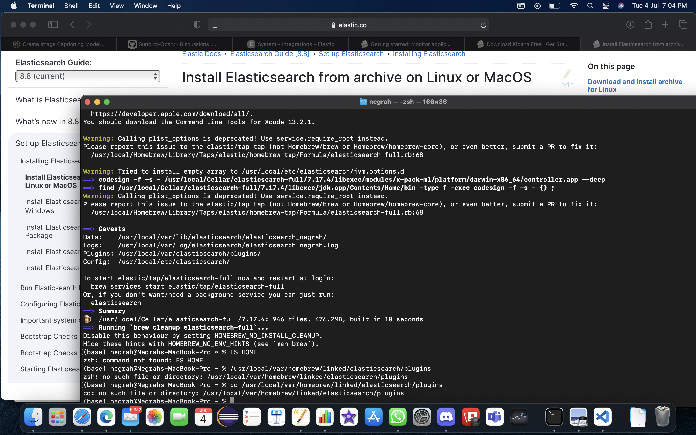
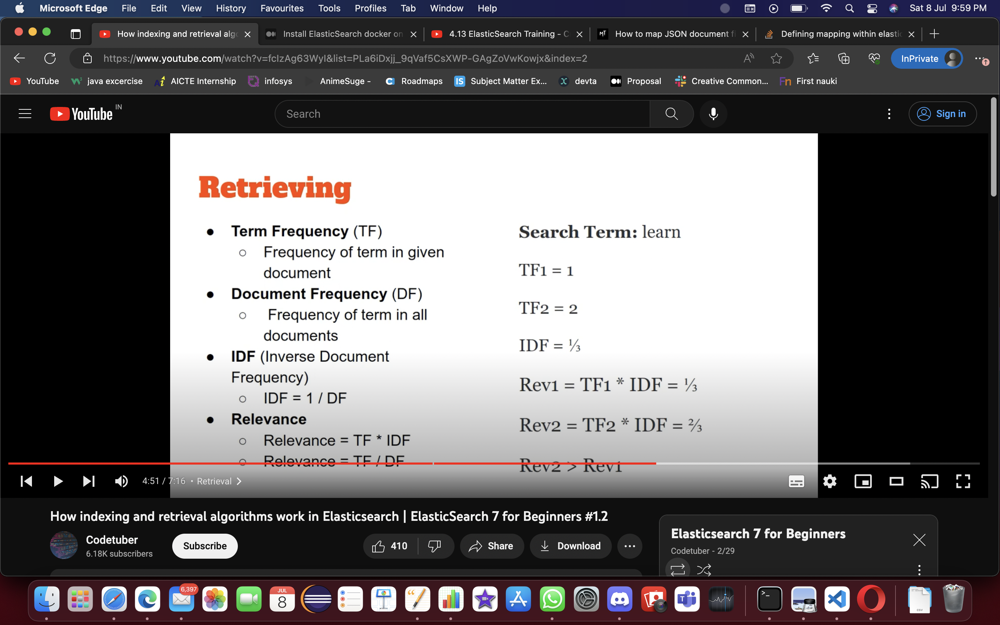

## Milestones

- [x] ES setup local device
- [x] Prepare a JSON sample file with few parameter (field)
- [x] Study about various tech stack need to be used example- kafka ,kubernetes, Docker
- Encountered a lot of problem to setup ES onto Local device , did took a week of time to setup and showed various error like update , Xcode version error and lot more .

## Screenshots / Videos

## Learnings

- Learnt about different Tech stack
- Kafka Basics
- ES web
- Docker

