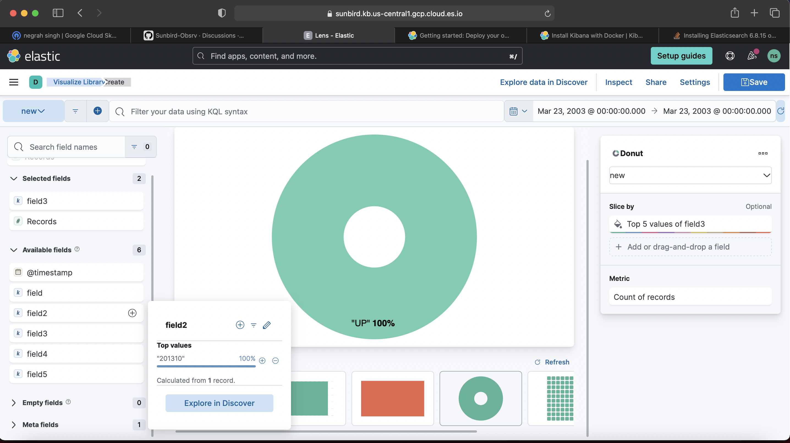
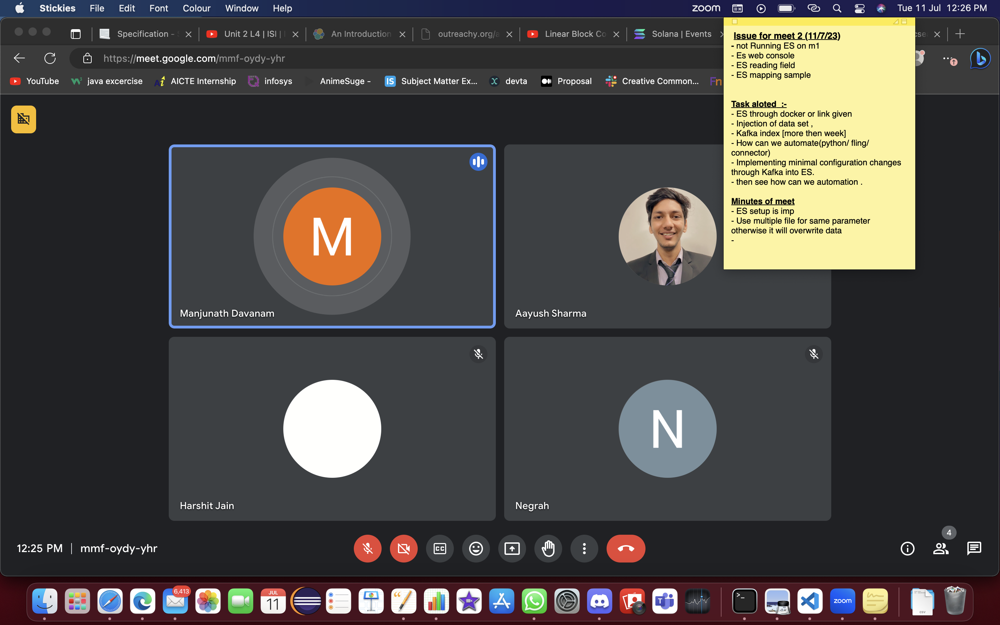

## Milestones
- [x] How to index Json data for ES
- [x] Completed my setup of ES 
- [x] Had a mentor meet for ahead 
- [x] Perform ES mapping on json file made in week 1

## Screenshots / Videos 

## Contribution
## Learnings
<ul><li>Learnt about how to index data in ES </li></ul>
<ul><li>Learnt ES mapping and interface of ES web </li><ul>

