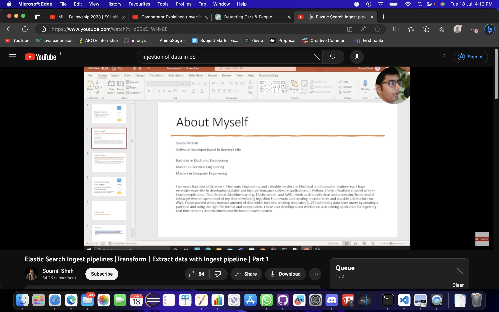
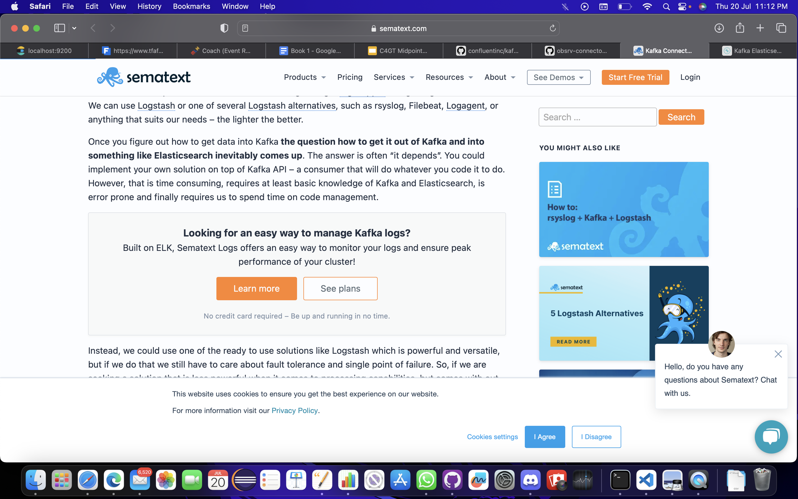

## Milestones

- [x]A Local repository was setup for showcasing work and all the files could be added only after approval by Mentor 
- [x] Study about Kafka 
- [x] Study ingest the data to es through Kafka  

## Screenshots / Videos

## Learnings
- Learnt about Kafka 
- Learnt ES pipeline and its working
- Learnt about ES injestion through kafka 

