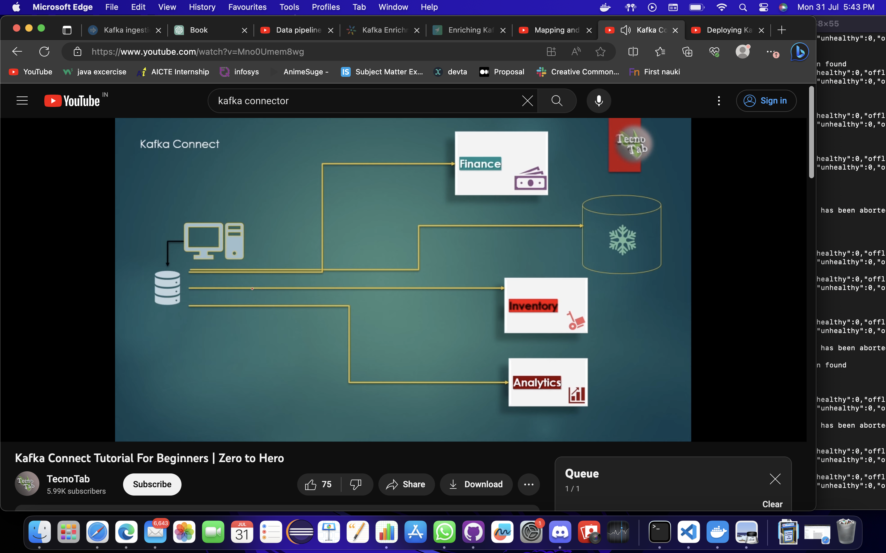
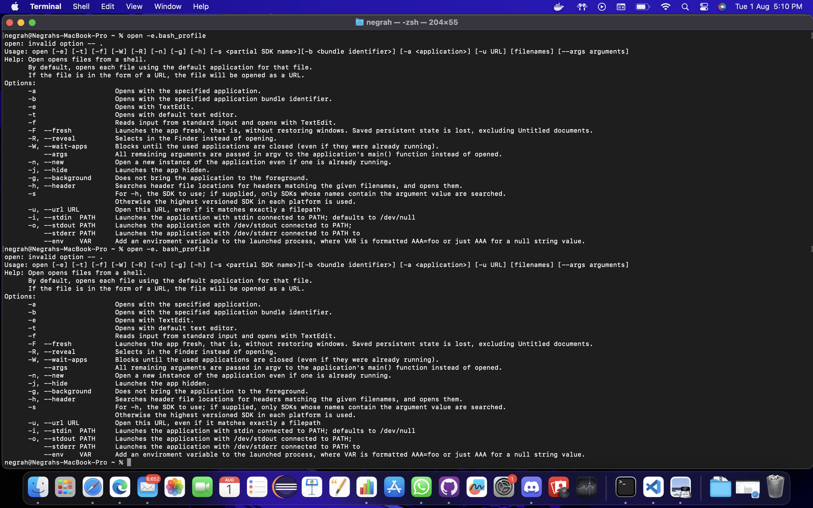
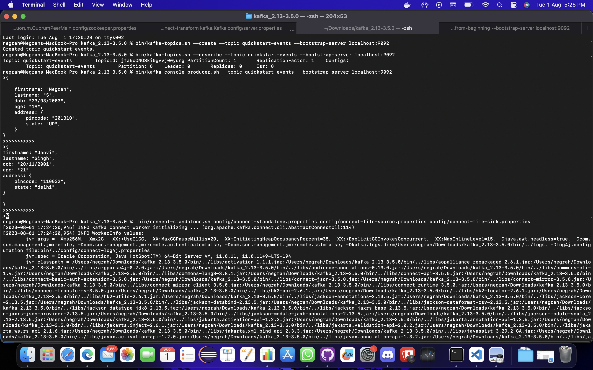
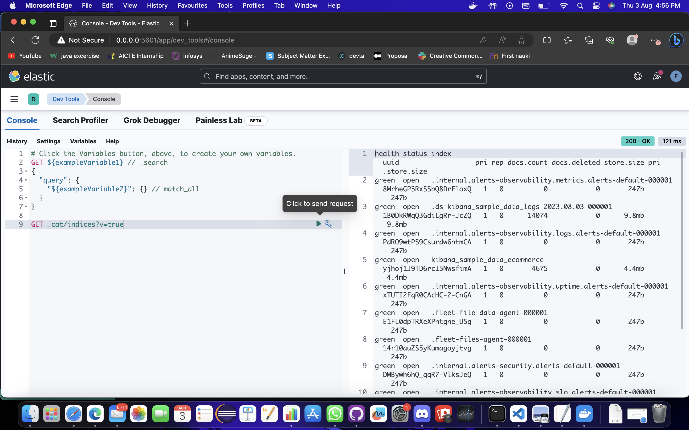

## Milestones
- Worked over the feedback in midterm evaluation and digged deeper into concepts of ES
- Kafka Connector ,maven installation 
- Studied about Flinkjob and its creation and requirement 

## Screenshots / Videos 

## Contributions

## Learnings
- Learnt about Kafka connect to ingest data into ES through it. 
- Faced problem with Maven Setup into system 
- Apache Flink and trouble shooted Maven issue