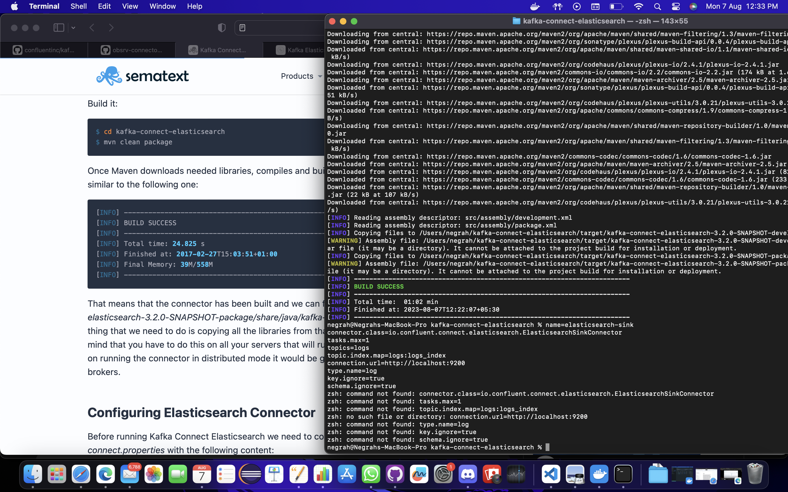
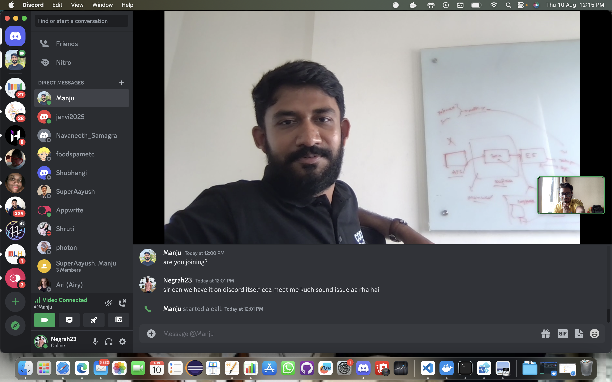

## Milestones

- [x] AWorked over kafka connector and learnt about libraries of confluent that can be implemented for the same.
- [x] Kafka Connector 1
- [x] Studied about helm , ksql and lot more like ingesting json into database directly  

## Screenshots / Videos

## Learnings
- Learnt about Kafka connect to ingest data into ES through it
- Faced problem with configration of connector and its credentials 
- Had a mentor meeting and a offline networking session 

