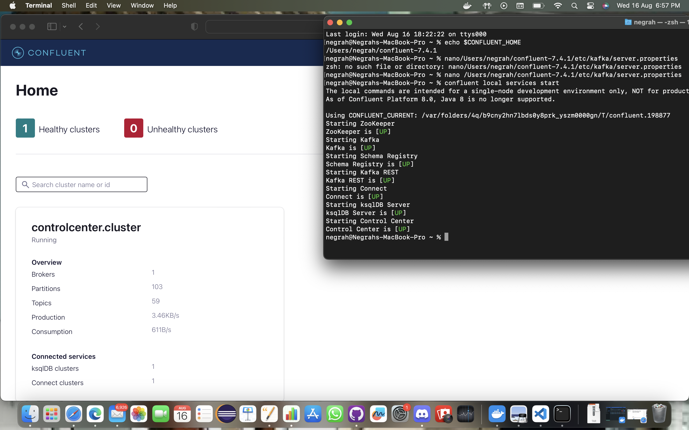
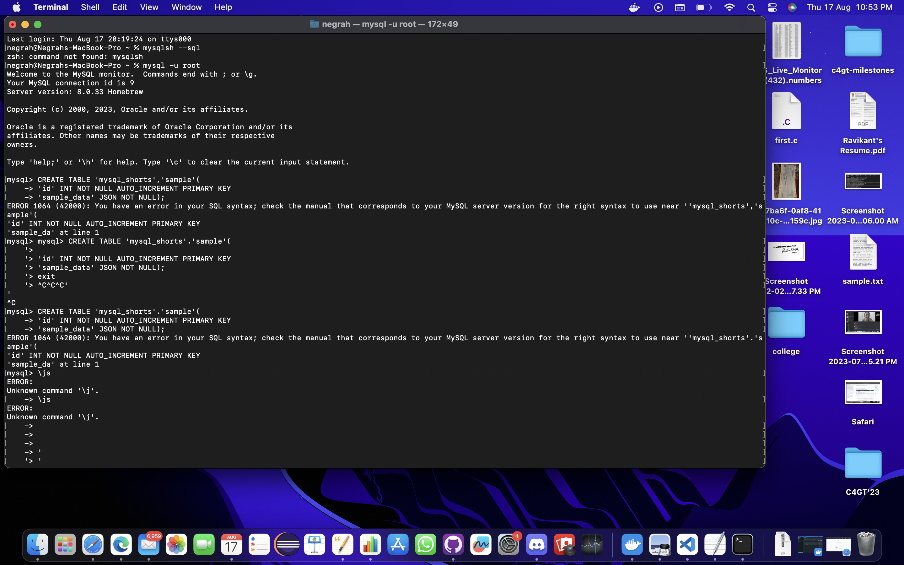
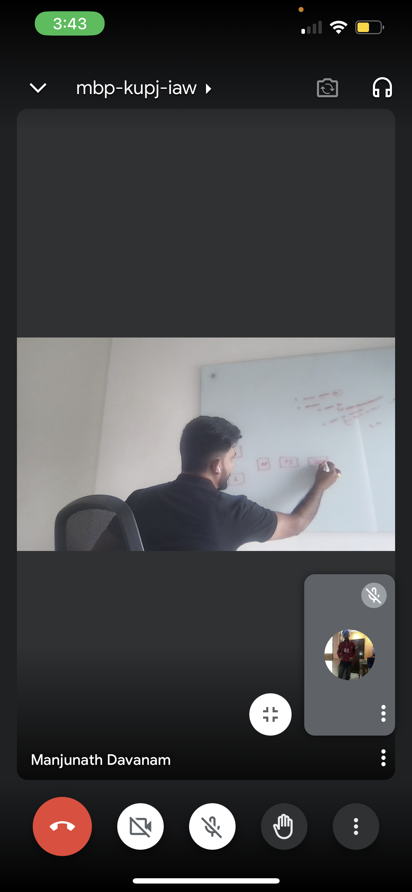

## Milestones
- [x] Worked on syncing Connector through exporting data from a database (MySQL)
- [x] Perfromed mapping Telementry data
- [x] Working of Kafka was checked including Topic and ingestion of data.
- [x] Made PR for kafka working and commands along with propeor documetnation. 

## Screenshots / Videos 

## Contributions
- https://github.com/NEGRAH-S/ES_C4GT/pull/7

## Learnings

- Learnt and understood telementry data.
- Learnt about imapct of project and future prospect in mentor meet.
- Made some final working to kafka
- Was able to make elastic mapping for extensive telementry data.
