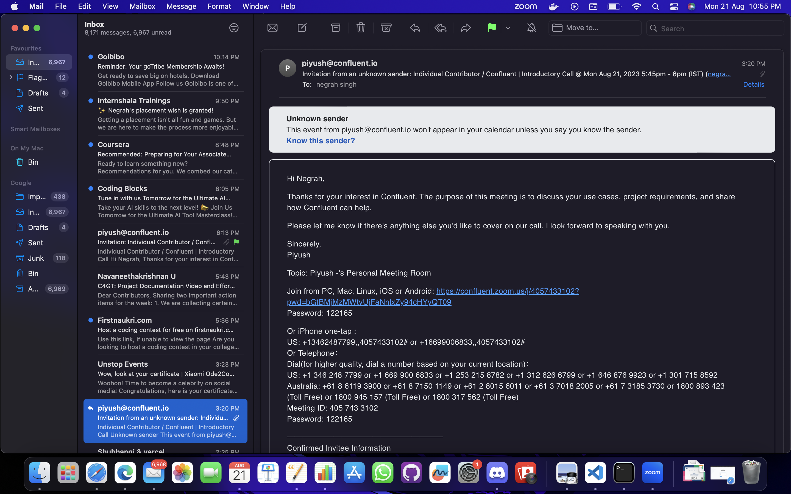
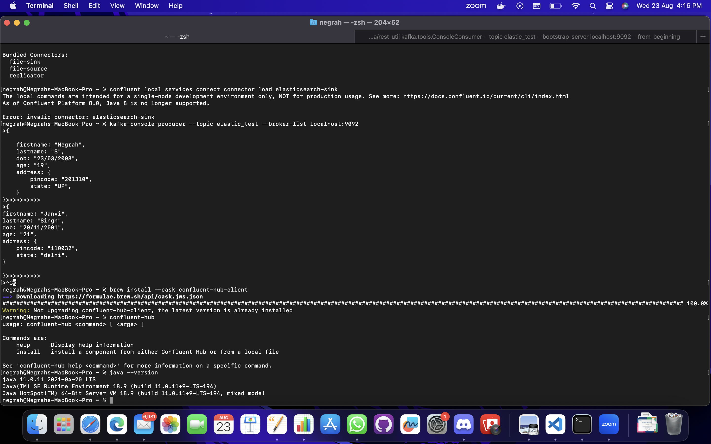

## Milestones
- [x] Was facing issue with the connector aspect of kafka therefore after raising a request was scheduled a Confluent meet with Mr.Piyush(Confluent development Representatative)
- [x] Elastic mapping of sumamry of telementry
- [x] Worked upon documentation for task done till now 
- [x] Had a end-term eval AMA session 

## Screenshots / Videos 

## Contributions
NA
## Learnings

- Learnt about the problems that can be encountered due to multiple points of error
- Worked upon documentation 
- will Make PR for mapping and other documentation in this week 
