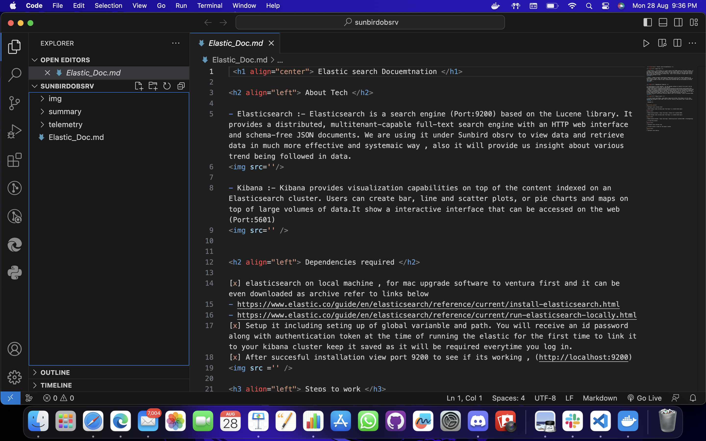
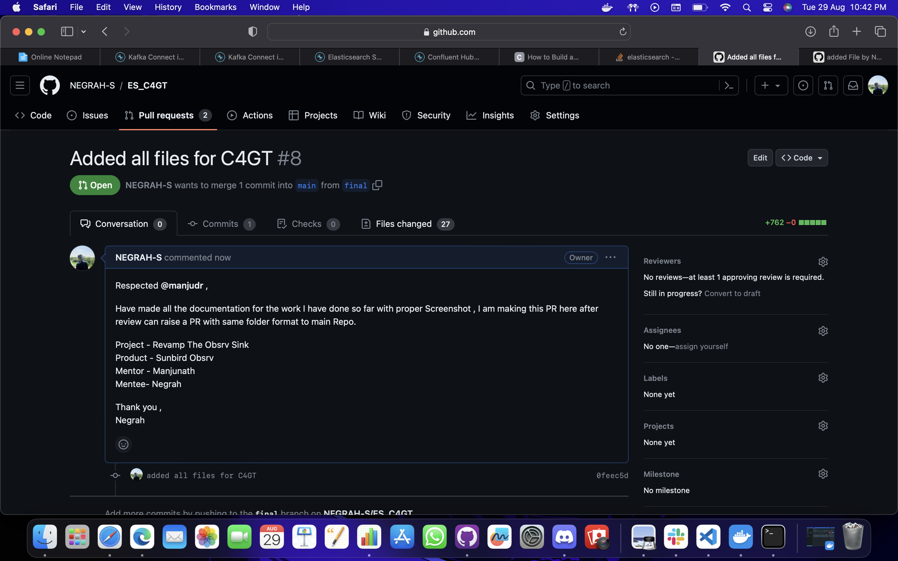
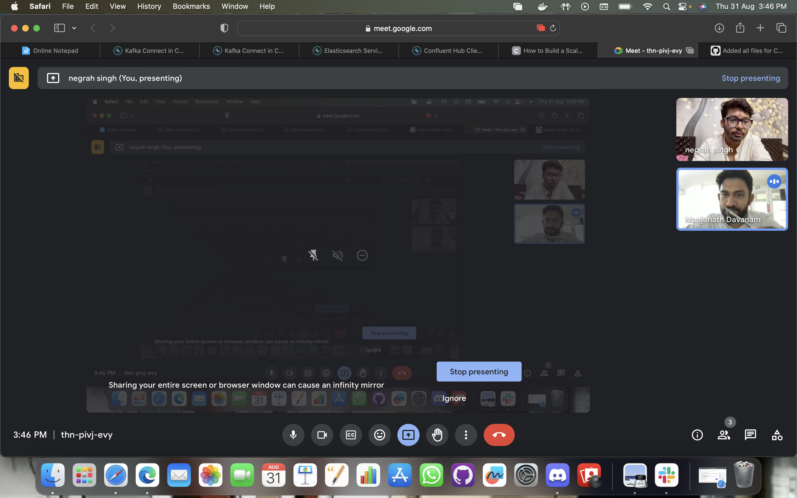
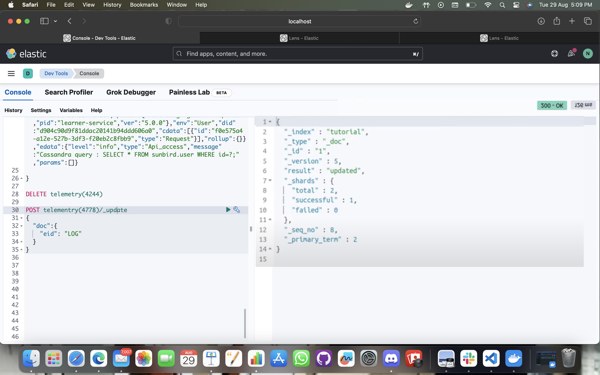

## Milestones

- [x] Raised multiple PR for mapping and final documentation 
- [x] Earlier made PR for each documentatio seprately but later on realised its 
not systematic and need to make it in more organised way.
- [x] Had a mentor meet with mentor and received reviews on final PR
- [x] Task for project has been extended therefore, cannot make PR to main repo 
and even after ending of C4GT I will be working on it as my personal project 

## Screenshots / Videos 

## Contributions

- https://github.com/NEGRAH-S/ES_C4GT/pull/8
- https://github.com/Sunbird-Obsrv/obsrv-core/pull/10

## Learnings

- This overall journey has been a great learning in my life .
- Working on various tech that I never interacted with seems amazing now and gives 
me a sense of fulfilment and confidence.
- Learnt how to make proper account of daily progress while woking on a project.
- Learnt a lot about making proper documentation of work done and codes written.
