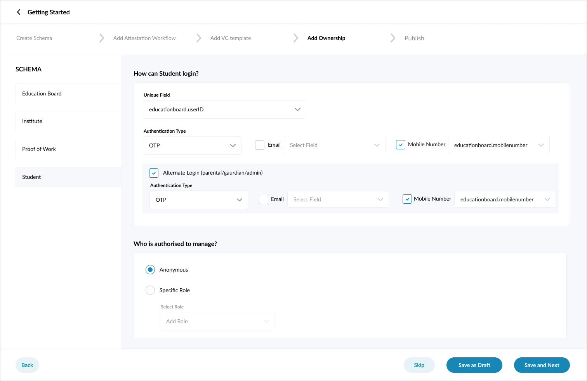

## Milestones
- [x] Develop UI screen for ownership page
- [x] Develop UI screen and form for attestation workflow

## Screenshots / Videos 

- Ownership page UI:

- Attestation workflow UI:

## Contributions

- [Ownership page UI Pull Request](https://github.com/Sunbird-RC/Admin-Portal/pull/97)
- [Attestation workflow UI Pull Request](https://github.com/Sunbird-RC/Admin-Portal/pull/99)

## Learnings

- Learned and practiced using and collaborting on Figma, a tool heavily used for UI/UX designing.
- Writing code to convert Figma designs to actual website UI