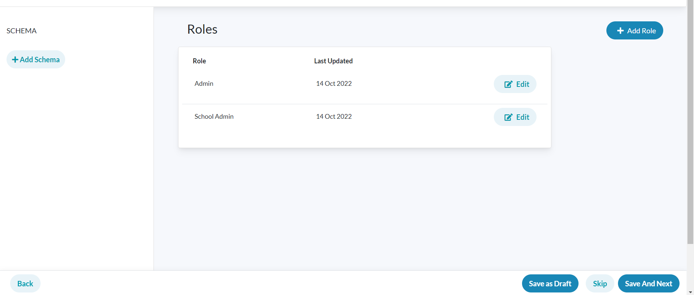

## Milestones
- [x] Develop UI screen for Roles page.
- [x] Understand the fundamental concepts of Sunbird RC Schemas.
- [x] Setup registry cli and interact with the swagger apis to get an understanding of the endpoints before working on them.

## Screenshots / Videos 

- Roles page UI:

## Contributions

## Learnings

- Learned about the structure of schemas used in sunbird-RC that is to be created using the admin portal.
- used registry cli to interact with the registry api like initializing a registry, inviting an entity, creating an entity, etc. 