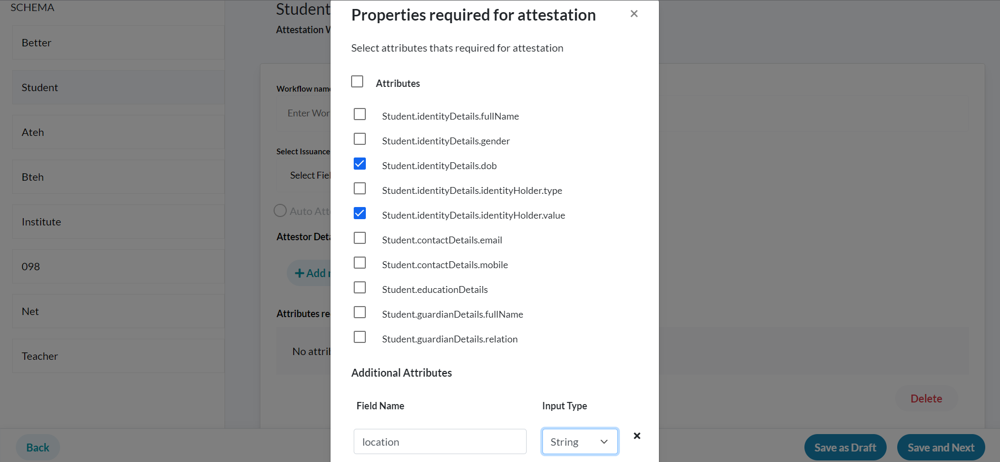

## Milestones
- [x] Added Modal for addition of attributes in attestation workflow page.
- [x] Added logic for implementation of additionalInput field in attestation Policy part of the schema on attestation workflow page.
- [x] Added logic for creation of "conditions" field in attestation Policy part of schema supporting single attestor and "equals" method currently. 

## Screenshots / Videos 
- Modal Screenshot
  

## Contributions
Added the commits to modify the Pull Request created last week:
  - [Contribution PR](https://github.com/Sunbird-RC/Admin-Portal/pull/114)

## Learnings
- Read about Java SpEL (Spring Expression Language) and how it can be used to evaluate expressions in Java.
- Java SpEL (Java Expression Language) is used to create the "conditions" field in the attestation Policy part of the schema. 