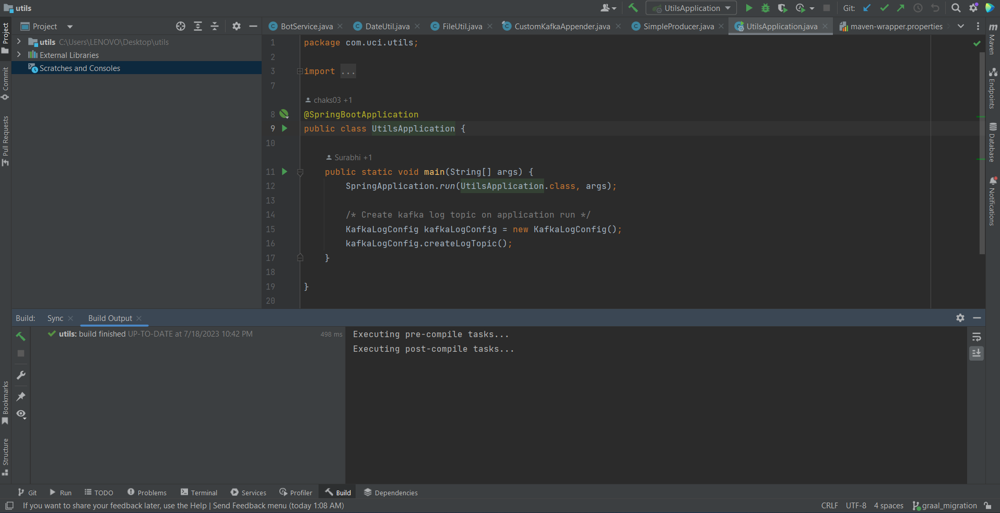

## Milestones
-   1.Understanding the current codebase

-   2.Making the Utils service code jdk 18 compatible

## Screenshots / Videos 

## Contributions
Debugged and removed all the errors which were coming to make the code jdk 18 compatible
## Learnings
Learnt about the following:
1. The architecture of the codebase
2. All the Transport layer services
3. Reactive programming (RxJava)
4. Implentations of Kafka
5. Using the IntelliJ IDEA IDE
