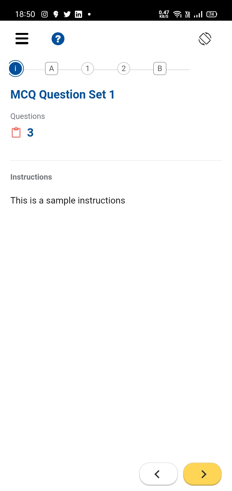

## Milestones

- [x] Initialising a React Native project
- [x] Integrating QuML player in the React Native application using HTML and QuML web component
- [x] Making the Metro bundler reconginse the HTML, JS and CSS files as assets and to be bundled in the application.

## Screenshots / Videos

## Contributions

https://github.com/Sunbird-inQuiry/player/pull/52/commits/150ea9f8dbda39fec40692429d67c6e2500d3064
https://github.com/Sunbird-inQuiry/player/pull/52/commits/9a72931f5daf0ed4191c18fd8784d7c3170a38aa

## pull request

https://github.com/Sunbird-inQuiry/player/pull/52

## Learnings

- [x] Learned about how to setup a proxy server for CORS correction and how to web view in React Native application.
