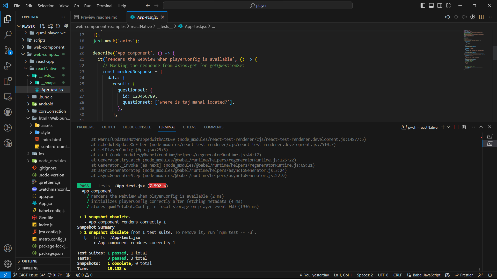

## Milestones

- [x] Made the metadata required for the application to be obtained dynamically by integrating the api's.
- [x] Made to application to access the local storage of the device for metadata.
- [x] Added the test cases for the application.
- [x] Added the a readme file for the application that contains the instructions on how to run and build the application.

## Screenshots / Videos

## Contributions

https://github.com/Sunbird-inQuiry/player/pull/52/commits/af9be7522e9f7dada77cb4ac9a75ff4597ba25d0
https://github.com/Sunbird-inQuiry/player/pull/52/commits/df03ebf9393e04d361b3293a19d08b1e2acb1beb

## Learnings

- [x] Learned about how to write test cases using jest and react-native-testing-library.
