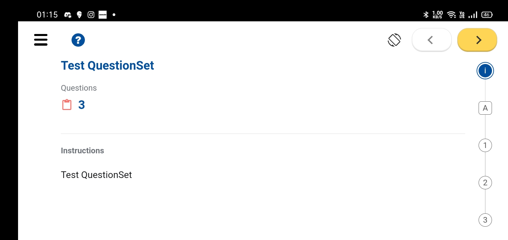

## Milestones

- [x] Added the rotation support for the application
- [x] Added the exit on exit player event
- [x] Started working on the choose identifier screen

## Screenshots / Videos

## Contributions

## Learnings

- [x] Learned about how to rotate the screen in React Native application.
