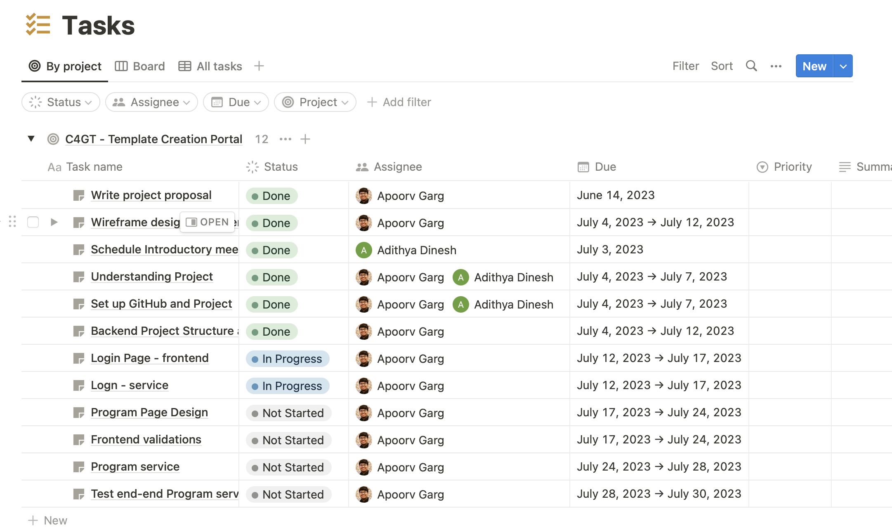
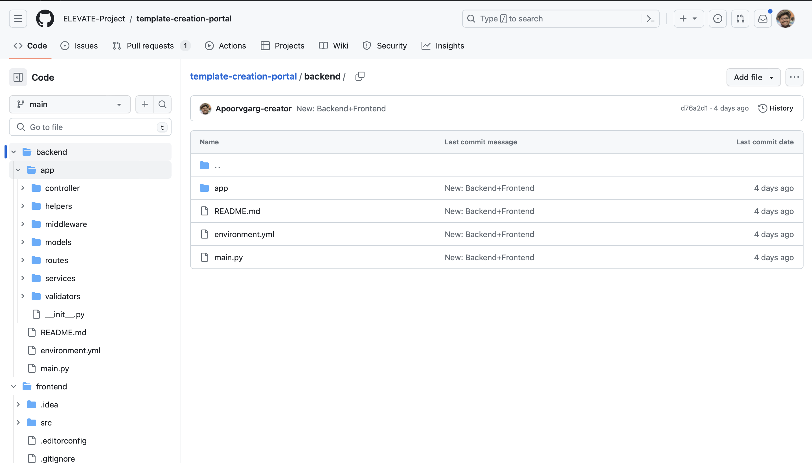
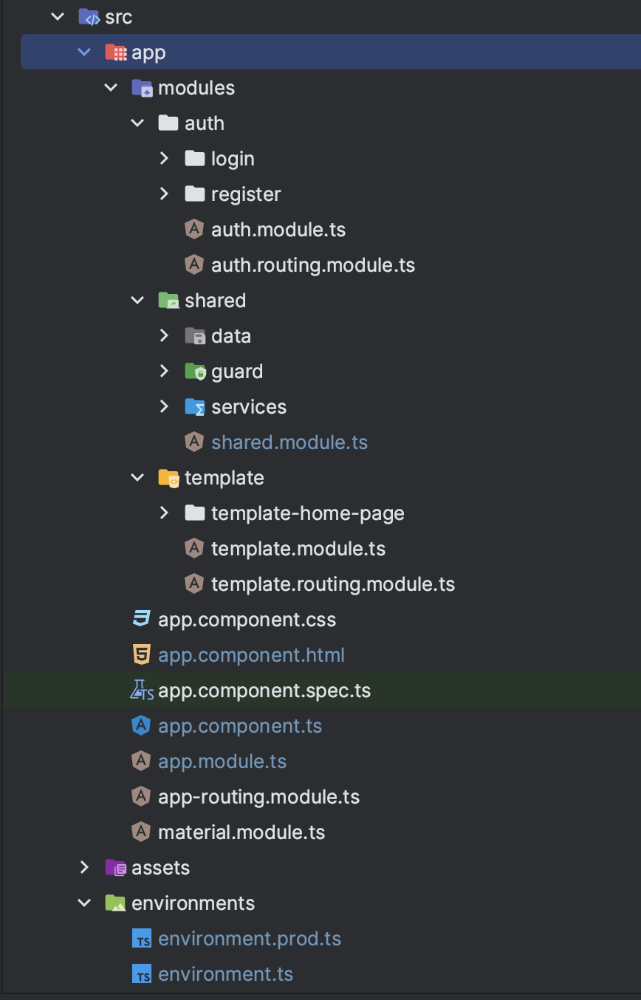
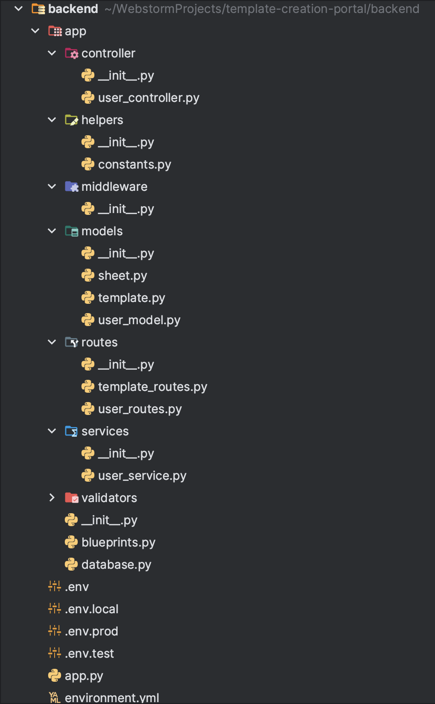

## Milestones
- [x] Project Architecture
- [x] Setup Project GitHub Repository
- [x] Create Initial Project Structure on Angular and Flask
- [x] Setup Task Management System (Notion)

## Screenshots / Videos

- Task Planning
  

- Github Repository
  

- Project Structure
    - Angular
      
  
    - Flask
      
        

## Contributions

- Commits (Directly pushed to Main)
    - [Commit-1 (Frontend Project Structure)](https://github.com/ELEVATE-Project/template-creation-portal/commit/d76a2d1e97190930b98fb7b8325df0c46fcf3f1e)
    - [Commit-2 (Backend Project Structure)](https://github.com/ELEVATE-Project/template-creation-portal/commit/d76a2d1e97190930b98fb7b8325df0c46fcf3f1e)

## Learnings

- Angular 
 
Angular is a popular JavaScript framework for building web applications. It follows the Model-View-Controller (MVC) architectural pattern and provides a structured and organized way to develop complex applications. Angular applications have a specific project structure that helps developers manage their code efficiently. Here's an overview of the typical project structure in Angular:

src Folder:
The src folder is the root directory of your Angular project and contains the main source code and assets. Inside the src folder, you'll find several important files and directories:

index.html: The entry point of your application, which is responsible for loading the Angular app into the browser and including necessary scripts and stylesheets.
main.ts: The main TypeScript file that bootstraps your Angular application by starting the Angular platform.
app folder: This is the heart of your application. It contains the components, services, modules, and other files that make up your Angular app.
assets folder: This directory stores static assets like images, fonts, and other resources that are used in your application.
App Structure:
Inside the app folder, you'll find the core components and modules that make up your Angular application. The structure typically consists of the following directories:

components: This directory contains the individual components of your application. Each component has its own folder with separate TypeScript, HTML, and CSS files. Components represent the different UI elements and views in your application.
services: The services directory contains the Angular services that provide functionality to components. Services handle data fetching, business logic, and communication with APIs or other external resources.
modules: Angular modules help organize and encapsulate related components, services, and other features. Modules define a boundary for the application and allow for lazy loading of code. Commonly used modules include AppModule (the root module), feature modules, and shared modules.
models: The models directory holds TypeScript interfaces or classes that define the structure and types of data used in your application.
guards: Guards are used to control access to certain routes in your application. The guards directory contains files that define route guards to protect routes based on conditions such as authentication or authorization.
pipes: Pipes in Angular are used for transforming data before displaying it in templates. The pipes directory contains custom pipes that you create for specific data transformations.
interceptors: Interceptors are used to intercept HTTP requests and responses. The interceptors directory contains files that define interceptors for adding custom headers, handling errors, or modifying requests and responses.
utils: The utils directory may contain utility functions or classes that provide common functionality or helper methods used across the application.
Configuration Files:
Angular projects have several configuration files that define project settings, dependencies, and build processes. Some important files are:

package.json: This file lists the project's dependencies, scripts, and metadata. It is used by the package manager (e.g., npm) to install and manage dependencies.
angular.json: The main configuration file for Angular projects. It defines settings such as build options, file paths, and asset configurations.
tsconfig.json: The TypeScript compiler configuration file that specifies the compiler options and paths for TypeScript files.
tslint.json: The configuration file for TSLint, a static analysis tool for TypeScript. It defines linting rules and settings for the project.
karma.conf.js and protractor.conf.js: Configuration files for running unit tests and end-to-end tests, respectively.
Build and Deployment:
Angular projects typically use the Angular CLI (Command Line Interface) for building, testing, and deploying applications. The CLI provides commands to generate components, services, and other artifacts, as well as compile and bundle the application for production. The build output is typically placed in a dist directory, which can be deployed to a web server or hosting platform.

The Angular project structure helps maintain a clean and organized codebase by separating concerns and promoting reusability. However, it's important to note that this structure is not set in stone and can be adapted to fit the needs of your specific project.

- Flask 

Flask is a popular web framework written in Python that allows developers to build web applications and APIs quickly and efficiently. It is known for its simplicity and flexibility, making it a great choice for creating APIs connected with MongoDB. In this model, I'll guide you through the project structure, including controllers, routes, services, and models, which are common components in Flask applications connected to MongoDB.

