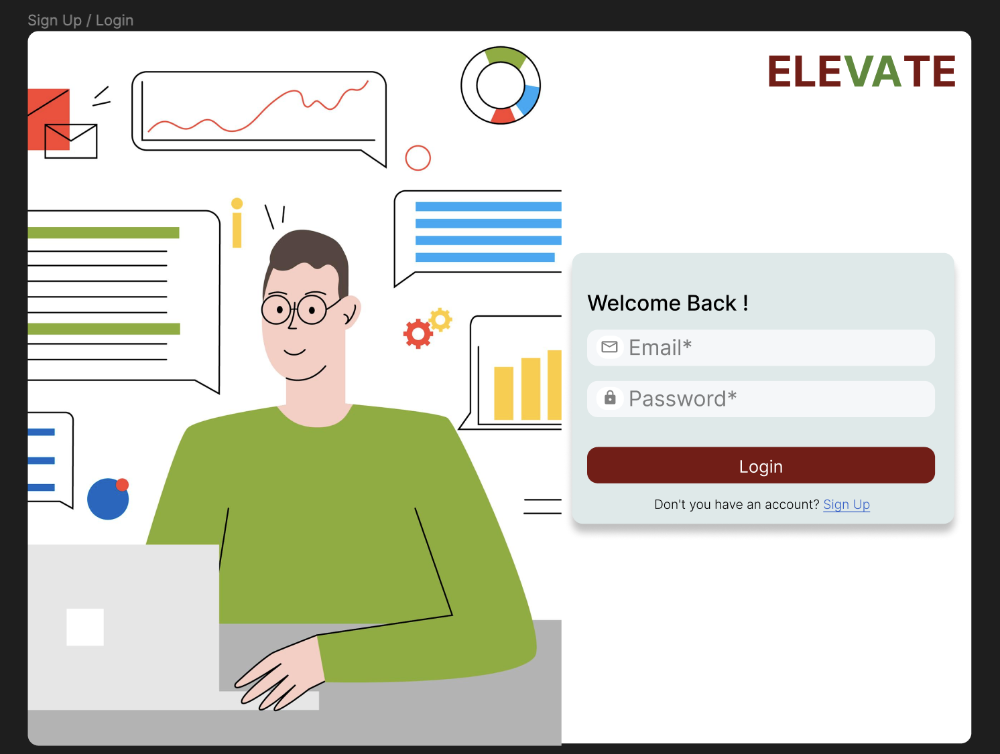
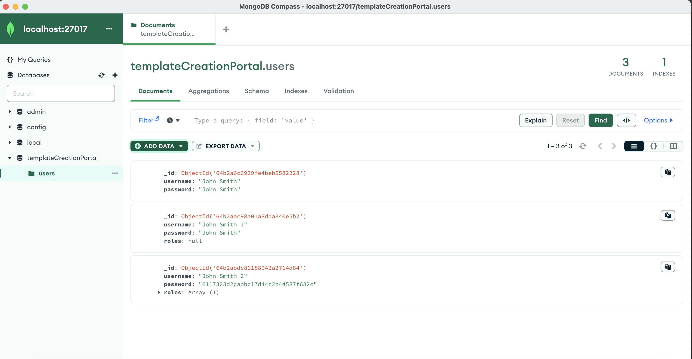

## Milestones
- [x] Wireframe Design for the frontend
- [x] Login Page [Frontend]
- [x] Connect MongoDb to Backend
- [x] Create Postman Documentation for API
- [x] Login Page [Backend]
- [x] Integrate Flask API in Angular Frontend

## Screenshots / Videos 

- **Login Page Wireframe Design**
 

- **Postman**
 

- **MongoDB**
 


## Contributions

- **Pull Request**
  - [PR#1 (Login Page + Login API)](https://github.com/ELEVATE-Project/template-creation-portal/pull/1)

## Learnings

- **Figma**

As a creative professional, I have always been keen on expanding my skillset and exploring new design tools. Recently, I embarked on a journey to learn Figma, a powerful and versatile design tool used by many designers and teams. Today, I want to share my experience and newfound knowledge in using Figma, specifically in the areas of prototyping, frames, components, and spacing.

One of the standout features of Figma is its prototyping capabilities. With Figma's prototyping tools, I was able to bring my designs to life and create interactive user experiences. Whether it was designing a mobile app or a website, Figma allowed me to easily link screens together, define interactions, and even incorporate animations. The intuitive interface and drag-and-drop functionality made prototyping a breeze, enabling me to iterate and refine my designs quickly.

Another fundamental concept in Figma is frames. Frames provide a structured way to organize and arrange design elements. I found frames to be incredibly useful in creating cohesive layouts, ensuring consistency across multiple screens or artboards. By using frames effectively, I could easily resize and rearrange design elements, allowing for a flexible and responsive design workflow.

Components are a powerful feature in Figma that greatly enhances design efficiency. Once I grasped the concept, I realized the immense time-saving potential. With components, I could create reusable design elements such as buttons, icons, or entire sections of a layout. Any changes made to a component would automatically update throughout the entire design, eliminating the need for manual adjustments. This feature not only sped up my design process but also helped maintain design consistency across various screens and projects.

In addition to the core features, I also learned about the importance of spacing in Figma. Proper spacing is crucial for creating visually pleasing and well-structured designs. Figma offers tools like layout grids, spacing shortcuts, and auto-layout functionality, which helped me achieve precise and consistent spacing between elements. Understanding how to leverage these features allowed me to create balanced designs and ensure optimal user experience.
 
- **Postman**

Learning how to document your API in Postman is a valuable skill for any developer or API provider. With Postman's built-in documentation feature, you can efficiently and effectively create comprehensive API documentation. By providing clear and detailed descriptions, organizing endpoints and parameters, and including code samples, you can ensure that developers using your API have all the information they need to integrate and interact with your services seamlessly. Mastering API documentation in Postman not only enhances the usability of your API but also contributes to a more streamlined and collaborative development process.

- **Running MongoDB instance via docker**

Docker provides a convenient and efficient way to set up and manage MongoDB containers, allowing for easy deployment and scalability. By following the necessary steps, I was able to pull the MongoDB image, configure the container settings, and start a fully functional MongoDB instance within minutes. Docker's flexibility and portability have made it an essential tool in my journey of working with MongoDB, providing a streamlined and reproducible environment for database management.

```bash
docker run --name mongodb -v mongodata:/data/db -d -p 27017:27017 mongo
```

- **Integrating Flask APIs with Angular**

By combining the power of Flask, a Python microframework for building web applications, with Angular, a popular front-end framework, I gained the ability to create dynamic and interactive web applications. The process involved setting up Flask APIs to handle data retrieval and manipulation, and then seamlessly connecting them to Angular components to display and interact with the data. This integration opened up endless possibilities for creating robust and efficient web applications that leverage the strengths of both Flask and Angular, providing a seamless user experience.

