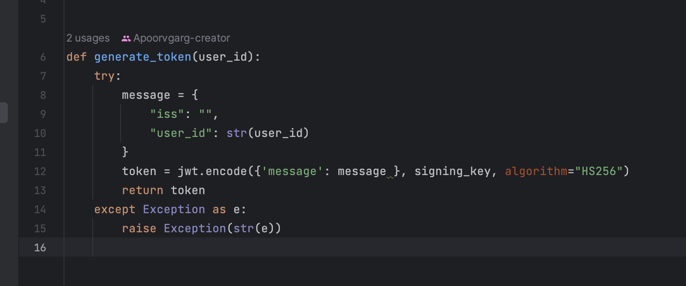
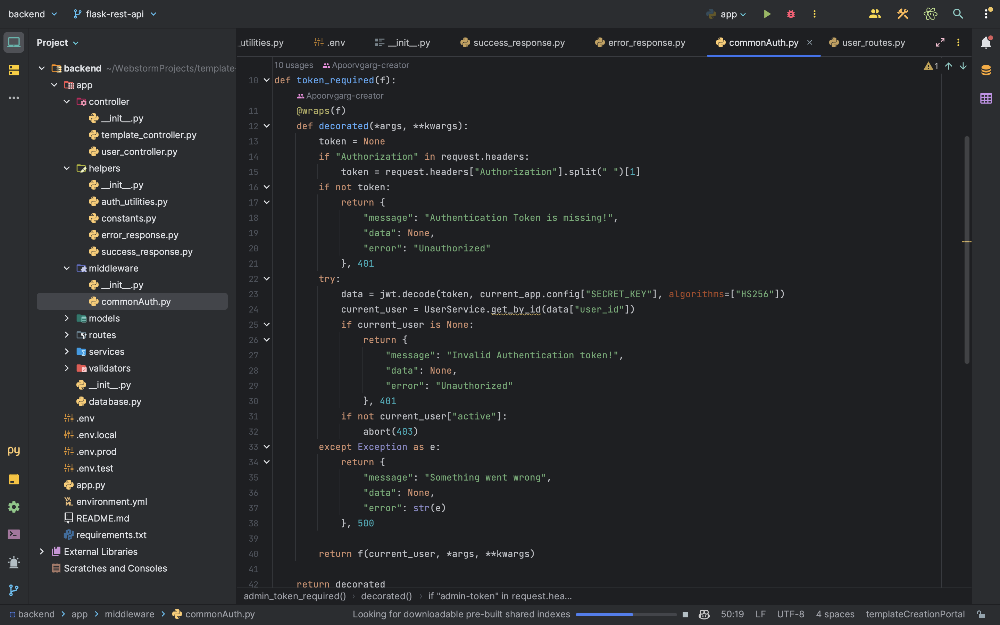

## Milestones
- [x] Authentication via jwt tokens
- [x] Creating Middleware in Flask API
- [x] Dynamic forms for Login page
- [x] Completing Login, Signup and Homepage
- [x] Enabling CORS in Flask 

## Screenshots / Videos 

- **Jwt Tokens**
  

- **Authentication Middleware in Flask**
  

## Contributions

- **Pull Request**
    - [PR#1 (Middleware + Authentication)](https://github.com/ELEVATE-Project/template-creation-portal/pull/1)
- **Commits**
    - [Commit showcasing authentication](https://github.com/ELEVATE-Project/template-creation-portal/pull/1/commits/a2c39191d2b4d338f6d562850863f92e7971d80c)

## Learnings

- **CORS in FLASK**

Cross-Origin Resource Sharing (CORS) is a vital security feature that allows web applications running on one domain to request and access resources hosted on another domain. In Flask, enabling CORS is crucial when building APIs or serving content to different clients. To enable CORS, developers can use the `Flask-Cors` extension, which simplifies the process. By setting the necessary headers, such as `Access-Control-Allow-Origin`, `Access-Control-Allow-Methods`, and `Access-Control-Allow-Headers`, Flask can handle incoming requests from specified origins, HTTP methods, and custom headers, thus ensuring secure and controlled cross-origin interactions between the server and client applications. This enables seamless communication and enhances the overall user experience while maintaining strict security measures.

- **Middleware and How to do them in Flask**

Middleware in web development are software components that intercept and process incoming HTTP requests and outgoing responses. They act as a bridge between the server and the application, allowing developers to implement cross-cutting concerns like authentication, logging, error handling, and CORS. In Flask, middlewares can be implemented using `before_request` and `after_request` decorators. The `before_request` decorator allows developers to define functions that run before the actual route handlers, enabling tasks such as authentication checks or request preprocessing. Similarly, the `after_request` decorator facilitates processing the response before it is sent back to the client, which is useful for adding headers or modifying the response data. These decorators provide a clean and modular way to manage common functionalities across multiple routes in a Flask application, promoting code reusability and maintainability. On the other hand, decorated functions in Python are regular functions enhanced with one or more decorators, allowing additional functionality to be added dynamically to the original function without modifying its code directly. Decorators in Python are denoted by the `@decorator_name` syntax and can be custom-defined or imported from libraries, making it a powerful mechanism for extending functionalities and implementing cross-cutting concerns in a flexible and elegant manner.

- **JWT Tokens**

JWT (JSON Web Tokens) authentication is a popular and secure method for validating the identity of users in web applications and APIs. It involves the use of digitally signed tokens that contain encoded user information and are passed between the client and server as HTTP headers or in the request payload. When a user logs in successfully, the server generates a JWT containing user-specific data, such as user ID or roles, and signs it using a secret key known only to the server. Subsequent client requests include this token, and the server verifies its authenticity and integrity through the signature. JWTs are stateless, meaning no user session is stored on the server, making them scalable and suitable for microservices architectures. Moreover, JWTs can carry additional custom claims for user-specific data, reducing the need for frequent database queries. However, developers must ensure the security of the secret key, use HTTPS to prevent eavesdropping, and include expiration times to manage token lifetimes effectively, safeguarding against token misuse or unauthorized access. Overall, JWT authentication provides a robust and efficient solution for securing modern web applications and APIs.

- **Dynamic forms in Angular**

Dynamic forms in Angular are a powerful and flexible way to create user interfaces that adapt to varying data structures and requirements. Unlike traditional static forms with fixed fields, dynamic forms are constructed at runtime based on dynamic data models, allowing developers to create reusable form components that can handle diverse data inputs. This is particularly useful when dealing with complex data structures, where the number of form fields or their types may vary depending on the user's selections or server responses. Angular provides various features to implement dynamic forms, such as reactive forms and template-driven forms. Reactive forms use a model-driven approach with form controls, form groups, and form arrays, while template-driven forms rely on directives to handle form elements. Developers can easily add or remove form controls, set validation rules, and handle form submission programmatically. This flexibility enables more efficient and maintainable form implementations, making dynamic forms a fundamental aspect of building modern, data-driven Angular applications.
