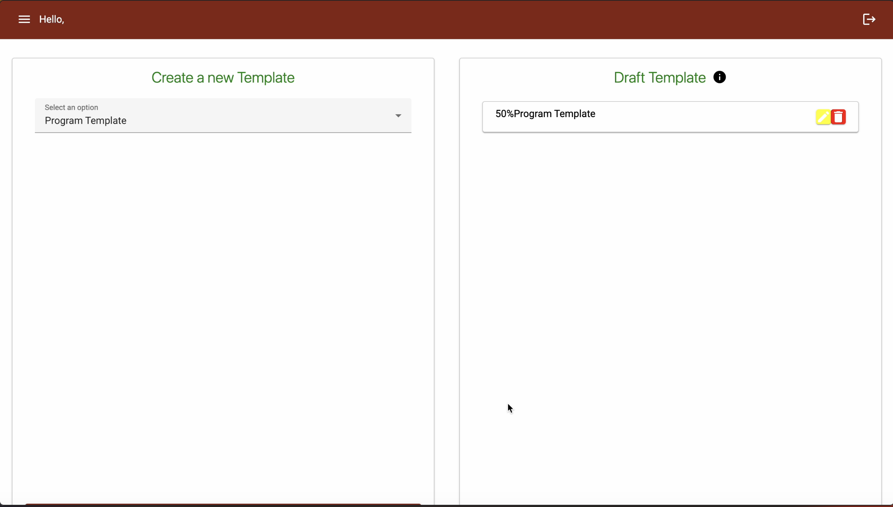
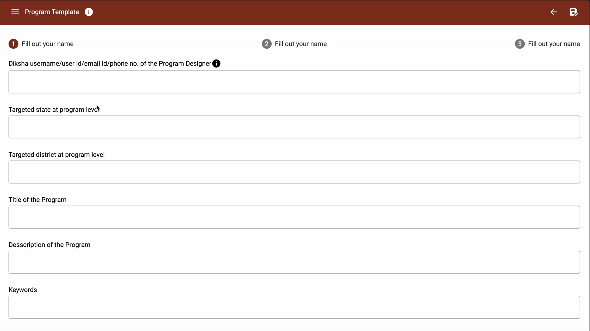

## Milestones
- [x] Stepper on Template Design
- [x] Homepage UI with Draft
- [x] Backend Validation and saving data in MongoDB
- [x] Export the the data into excel

## Screenshots / Videos 
- Homepage UI with Draft feature
 

- Steppers on Template Design
 
## Contributions

- [PR for Draft Features](https://github.com/ELEVATE-Project/template-creation-portal/pull/3)
## Learnings

*Save Drafts*: When a user wants to save a draft of the form, gather the form data and create a new document in the drafts collection using the defined schema. Use the appropriate methods provided by the MongoDB driver to insert the document.

*Update Drafts*: To allow users to update their drafts, implement functionality to update existing draft documents. MongoDB's powerful update operators can help modify specific fields within a document efficiently.

*Retrieve Drafts*: When a user returns to work on a draft, retrieve the draft document from the collection using queries that match the user's unique identifier. This could be their user ID or a session token, depending on your application's design.

*Delete Drafts*: Implement a way to delete drafts when they are no longer needed. Use MongoDB's delete operations to remove draft documents from the collection.

