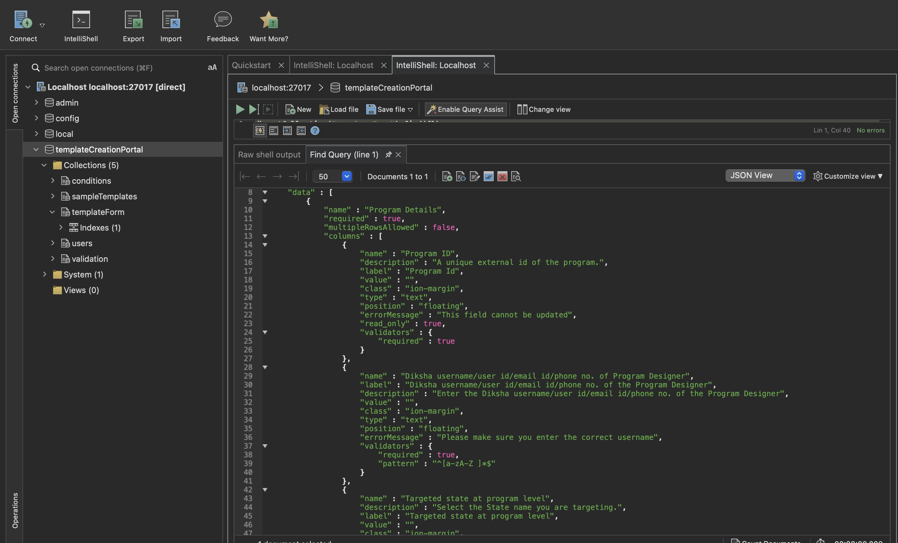
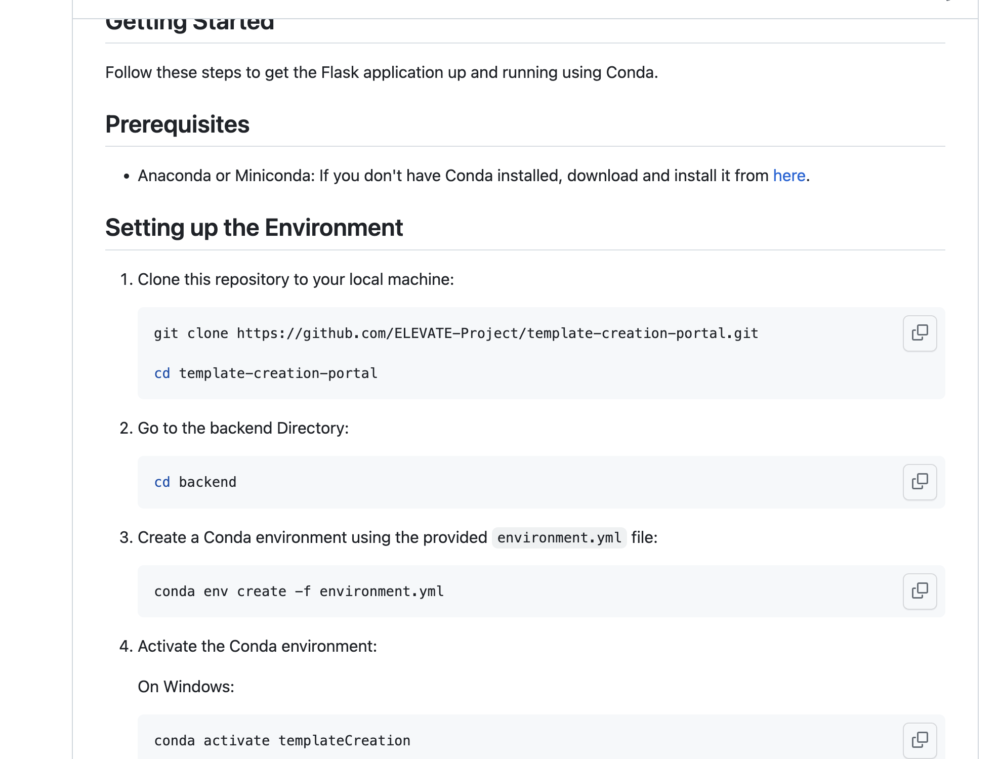

## Milestones
- [x] Integrating External Services 
- [x] Using Mongo Dump and adding required data
- [x] Improving User Experience
- [x] Wrapping up the Projects Minor Details


## Screenshots / Videos 
- Studio RT 
    

- Updated Readme.MD for Other developer
    
## Contributions

- Adding Sample Data
    [Mongodb data PR](https://github.com/ELEVATE-Project/template-creation-portal/pull/3/commits/9d97f40f49caba06f0622840ca0517461db3bf35)
## Learnings

**1. MongoDB Dump:**
Dumping a MongoDB database involves creating a backup of its data and structure. The `mongodump` command is used for this purpose. Here's how it works:

- Open a terminal or command prompt.
- Navigate to the directory where MongoDB's `bin` folder is located.
- Run the following command to perform a database dump:

  ```bash
  mongodump --db <database_name> --out <output_directory>
  ```

  Replace `<database_name>` with the name of the database you want to dump and `<output_directory>` with the path where you want to save the backup.

**2. MongoDB Restore:**
Restoring a MongoDB database involves recreating a database from a previously created backup. The `mongorestore` command is used for this purpose. Here's how it works:

- Open a terminal or command prompt.
- Navigate to the directory where MongoDB's `bin` folder is located.
- Run the following command to perform a database restore:

  ```bash
  mongorestore --db <database_name> <input_directory>
  ```

  Replace `<database_name>` with the name of the database you want to restore and `<input_directory>` with the path to the backup directory.

**Key Learnings:**

- **Backup and Recovery:** Dumping and restoring databases are crucial for data backup and recovery strategies. Regular backups ensure data safety against failures and disasters.

- **Data Migration:** Dumping and restoring databases are also used for migrating data between different environments, such as from development to production.

- **Command Syntax:** The `mongodump` and `mongorestore` commands are part of the MongoDB tools suite. Both commands should be executed from the command line, specifying the required parameters.

- **Database Isolation:** It's generally a good practice to isolate the database during the dump and restore process to prevent data inconsistencies during restoration.

- **Backup Compression:** MongoDB allows you to compress backups during the dump process using the `--gzip` option. This can significantly reduce the backup file size.

- **Authentication and Authorization:** Depending on your MongoDB setup, you might need to provide authentication credentials using the `--username` and `--password` options during both dump and restore operations.

- **Indexes and Metadata:** MongoDB's `mongodump` command also backs up indexes and metadata, which are crucial for data integrity and query performance.

- **Efficient Restores:** MongoDB's `mongorestore` command can perform parallelized imports, speeding up the restoration process for large datasets.

